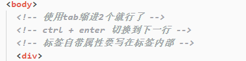
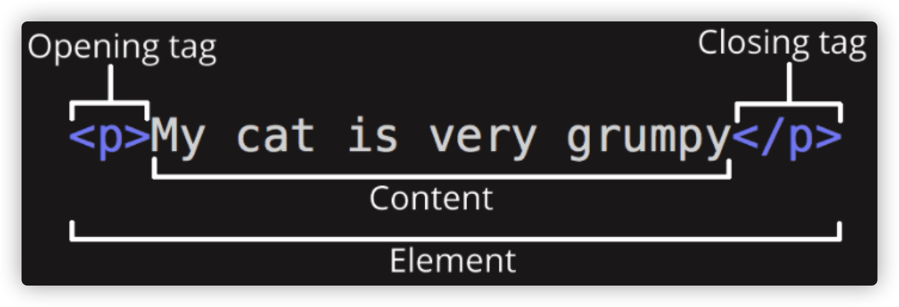
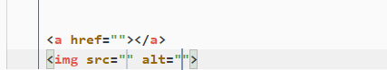

# HTML总结

### 1.什么HTML？

> 超文本标记语言（英语：**HyperText Markup Language**，简称：**HTML**）是一种用于创建网页的标准标记语言。可以由一系列HTML元素组合成web开发人员想要的简单或者复杂的页面。包含**图片**、**链接**、**音乐**、甚至是**程序**等等的非文本元素。HTML通过标记符号来标记要显示的网页中的各个部分。浏览器则会按顺序阅读网页文件，然后根据标记符号来显示其内容。错误的标记不会指出，而且不停止其解释执行过程，编辑者只能通过查看页面效果来找出出错部位，使用**.html**和**.htm**作为HTML文件的后缀

### 2.HTML的特点。

- 简易性：超文本标记语言版本升级采用超集方式，从而更加灵活方便。 
- 可扩展性：超文本标记语言的广泛应用带来了加强功能，增加标识符等要求，超文本标记语言采取子类元素的方式，为系统扩展带来保证。 
- 平台无关性：虽然个人计算机大行其道，但使用MAC等其他机器的大有人在，超文本标记语言可以使用在广泛的平台上，这也是万维网（WWW）盛行的另一个原因。
- 通用性：另外,HTML是网络的通用语言，一种简单、通用的全置标记语言。它允许网页制作人建立文本与图片相结合的复杂页面，这些页面可以被网上任何其他人浏览到，无论使用的是什么类型的电脑或浏览器。

### 3.初始HTML

#### 3.1HTML页面结构

```html
<!-- 文档头信息 -->
<!-- html5标准网页声明 -->
<!-- 不加这一行，就表示页面采用浏览器本身的解析标准，这样会造成页面在不同的浏览器（IE、火狐等）可能出现不同的显示效果。 -->
<!DOCTYPE html>
<!-- 语言，”en”代表英语，”zh-CN”代表中文 -->
<!-- 
	html根标签，一个页面中有且只有一个根标签，网页中的所有内容都应该写在html根标签中
-->
<!-- 只有两个子标签 head:浏览器设置 body：可视区展示 -->
<html lang="en">
<!-- head标签，该标签中的内容，不会在网页中直接显示，它用来帮助浏览器解析页面的 -->
<head>
  <!-- 
        字符编码，浏览器会根据字符编码进行解析
        常见的字符编码有：gb2312、gbk、unicode、utf-8。
  -->
  <meta charset="UTF-8">
  <meta name="viewport" content="width=device-width, initial-scale=1.0">
  <!-- 浏览器选项卡上的名字 -->
  <title>Hello HTML</title>
</head>
<!--body标签用来设置网页的主体内容，网页中所有可见的内容，都应该在body中编写-->
<body>
  <!-- 在body里的内容都是显示在浏览器的视图区的 -->
</body>
</html>
```

#### 3.2 HTML语法

##### 3.2.1 注释

如何在html中注释，使用<!--注释内容--->即可

**示例：**



在日常写代码中,我们不仅要有良好的代码规范，注释也是必不可少的，这样可以记录你的编程思路，也可以解释说明业务逻辑

##### 3.2.2 元素

单标签元素，就是只有一个标签

```html
<meta /> 、、<br/>
```

双标签元素，即有开始标签和结束标签

```html
<div></div>
<p></p>
```



##### 3.2.3 属性

属性是 HTML 元素提供的附加信息,属性一般描述于**开始标签**,属性值应该始终被**包括在引号**内,属性总是以名称/值对的形式出现，**比如：name="value"**。

**示例:** 

​        

特定的标签属性 ：

| 标签 | 属性          |
| ---- | ------------- |
| a    | href          |
| img  | alt src title |

还有公共属性

| 属性  | 描述                                                         |
| ----- | ------------------------------------------------------------ |
| class | 为html元素定义一个或多个类名（classname）(类名从样式文件引入) |
| id    | 定义元素的唯一id                                             |
| style | 规定元素的行内样式（inline style）                           |
| title | 描述了元素的额外信息 (作为工具条使用)                        |

##### 3.2.4 其他

> 空白
> 在文档中无论出现多少个空白或者换行，浏览器都解析为一个空白
> 实体
> 在HTML中，某些字符是预留的。例如：不能使用小于号<和大于号>，这是因为浏览器会误认为它们是标签。如果希望正确地显示预留字符，我们必须在 HTML 源代码中使用字符实体（character entities)，实体以&符开始，以;结尾。以下是常见的实体

| 显示结果 | 描述              | 实体名称         | 实体编号 |
| :------- | :---------------- | :--------------- | :------- |
|          | 空格              | &nbsp            | &#160    |
| <        | 小于号            | &lt              | &#60     |
| >        | 大于号            | &gt              | &#62     |
| &        | 和号              | &amp             | &#38     |
| "        | 引号              | &quot            | &#34     |
| '        | 撇号              | &apos (IE不支持) | &#39     |
| ￠       | 分（cent）        | &cent            | &#162    |
| £        | 镑（pound）       | &pound           | &#163    |
| ¥        | 元（yen）         | &yen             | &#165    |
| €        | 欧元（euro）      | &euro            | &#8364   |
| §        | 小节              | &sect            | &#167    |
| ©        | 版权（copyright） | &copy            | &#169    |
| ®        | 注册商标          | &reg             | &#174    |
| ™        | 商标              | &trade           | &#8482   |
| ×        | 乘号              | &times           | &#215    |
| ÷        | 除号              | &divide          | &#247    |

#### 3.4 块级元素

作用：搭建网页结构

特点：

- 独占一行空间
- 默认宽度为100%
- 高度可以由子元素或者内容决定
- 可以通过css指定其宽度

包含的块级元素有以下内容

| **元素** | **作用**                                    | **已有CSS效果**                   |
| :------- | :------------------------------------------ | :-------------------------------- |
| div      | 无意义的块元素                              |                                   |
| h1~h3    | 标题标题                                    | margin  font-size font-weight     |
| p        | 段落                                        | margin                            |
| ul,li    | 无序列表                                    | margin padding list-style         |
| ol,li    | 有序列表                                    | margin padding list-style         |
| dl,dt,dd | 定义列表                                    | dl - margin    dd - margin        |
| html     |                                             |                                   |
| body     |                                             | margin                            |
| header   | H5新增的语义化标签```<br>```(样式与div类似) | ```<div class="header"></div>```  |
| footer   |                                             | ```<div class="footer"></div>```  |
| nav      |                                             | ```<div class="nav"></div>```     |
| article  |                                             | ```<div class="article"></div>``` |
| section  |                                             | ```<div class="section"></div>``` |
| aside    |                                             | ```<div class="aside"></div>```   |
| address  |                                             | ```<div class="address"></div>``` |

#### 3.5行内元素

作用：在结构中填充网页内容

特点：

- 与其他行内元素共享一行空间
- 宽高由自身决定
- 由于不用来搭建网页结构，所以也无需通过css指定其宽度
- 行内元素中不可以嵌套块元素

包含的行内元素有以下内容


### 4. 基础标签的使用

**1.h标签**

在HTML文档中，标题很重要，标题（Heading）是通过 <h1> - <h6> 标签进行定义的。在显示效果上，h1->h6字体逐渐变小，我们使用的时候显示效果不是最重要的，而是标题的等级最重要，h1标题最重要，h2~h6逐渐降低，对于搜索引擎来说，h1标签仅次于title，搜索引擎检索完title会立即查看h1中的内容，**一个页面最好只用一个h1标签**，因为**它会影响到页面在搜索引擎中的排名**

示例：

搜索出来页面使用的是h1标签

**2.p标签**

段落标签，段落标签用于表示内容中的一个自然段
使用p标签来表示一个段落
p标签中的文字，会独占一行，并且段与段之间会有一个间距

##### 3.br标签

br标签 表示换行标签 br标签是一个自结束标签 br标签的语义是不另起一个段落换行, 而在企业开发中一般情况下需要换行都是因为需要另起一个段落, 所以在企业开发中很少使用br标签

##### 4.hr标签

hr标签 可以在页面中生成一个分割线

##### 5.字符实体

```html
空格  &nbsp;
  <  &lt;
  >  &gt;
  “  &quot;
  &  &amp;
  ‘  &apos;
```

##### 6.img标签

作用：是告诉浏览器需要显示一张图片

```
img标签的格式 

```

| 属性   | 描述                                                         |
| ------ | ------------------------------------------------------------ |
| src    | 设置一个图片的路径（绝对路径和相对路径，最好使用相对路径）   |
| alt    | 可以用来设置在图片不能显示的时，对图片的描述                 |
| img    | 标签的其他属性                                               |
| width  | 设置图片的宽度                                               |
| height | 设置图片的高度                                               |
| title  | 用于告诉浏览器，鼠标悬停的时候，需要弹出的描述框中显示什么内容。 |

注意点：

- width属性和height属性，若不添加到标签内部，则会根据图片的分辨率来在页面中显示相应的大小，若要添加，最好**只添加其中一个属性** ，**只添加一个属性**，**另一个属性则会根据添加的属性一比一显示**，**若两个都添加则会让原本的图片失真**
- 一般除了自适应的页面，不建议设置width和height。
- 和h标签以及p标签不同的是，img标签不会独占一行

**7.a标签**

作用：用户控制页面与页面之间跳转

```
<a href="指定需要跳转的目标界面">需要展现给用户查看的内容</a>
<a href="https://www.baidu.com" target="_blank" title="百度">百度一下</a>
```

| 属性   | 描述                     |
| ------ | ------------------------ |
| target | 专门用于控制如何跳转     |
| title  | 效果和img标签的title类似 |

注意点:

- target属性有两个值  

1. _self:用于当前的选项卡中进行跳转，也就是不新建页面跳转，默认就是self
2.   _blank:用于在新的选项卡中进行跳转，也就是新建页面跳转

- a标签不仅可以让文字点击，也可以让图片被点击

```html
<a href=""></a>
```

- 如果通过a标签href属性指定一个URL地址，那么必须在地址前面加上http://或者https:// 除了URL地址，还可以指定一个本地地址

**8.base标签**

作用：base标签就是专门用来统一指定当前页面中所有的a标签需要如何打开

```html
<head>
    <meta charset="UTF-8">
    <meta name="viewport" content="width=device-width, initial-scale=1.0">
    <meta http-equiv="X-UA-Compatible" content="ie=edge">
    <title>Document</title>
    <base target="_blank">
</head>
<body>
    <a href="https://www.baidu.com" target="_self">百度</a>
    <a href="https://www.baidu.com">百度</a>
</body>
```

注意点:

- base标签必须要写在head标签之间
- 如果既在base中指定了target又在a标签中指定了target，那么浏览器会按照a标签中指定的来执行   标签内>base中

**9.假链接**

什么是假链接？
就是点击之后不需要跳转的链接我们称之为假链接

```html
<a href="#">回到顶部</a>
<a href="javascript:">点我啊</a>
```

**10.锚点**

作用：根据id跳转到使用该id的dom元素的位置

```html
<a href="#center">跳转</a>
<br>
<br>
<br>
<br>
<br>
<br>
<br>
<br>
<p id="center">我是中部</p>
<br>
<br>
<br>
<br>
<br>
<br>
<br>
<br>
```

注意点:

- 通过我们的a标签跳转到指定的位置, 是没有过度动画的, 是直接一下子就跳转到了指定位置
- a标签除了可以跳转到当前界面的指定位置以外, 还可以在跳转到其它界面的时候直接跳转到其它界面的指定位置   格式：跳转页面+id

```html
<a href="b.html#bottom" target="_blank">跳转</a>
```

### 5.功能标签

#### 1.列表标签

作用:给一堆数据添加列表语义，也就是告诉搜索引擎告诉浏览器这一堆数据是一个整体

**列表标签的分类**

| 无序列表(最多) | (unordered list)  |
| -------------- | ----------------- |
| 有序列表(最少) | (ordered list)    |
| 定义列表(其次) | (definition list) |

1.1 无序列表

```html
<ul><li> <li><ul>
    type
disc    默认值 实心圆
circle  空心圆
square  实心方块
```

适用：班级-学生，导航栏

1.2 有序列表

```html
<ol><li> <li><ol>
      type
1   默认值。数字有序列表。（1、2、3、4）
a   按字母顺序排列的有序列表，小写。（a、b、c、d）
A   按字母顺序排列的有序列表，大写。（A、B、C、D）
i   罗马字母，小写。（i, ii, iii, iv）
I   罗马字母，大写。（I, II, III, IV）
```

适用：奥运会排行榜

#### 2.表格标签

作用:用来给一堆数据添加表格语义

```
<table>
  <tr>
    <td>姓名</td>
    <td>年龄</td>
    <td>身高</td>
  </tr>
  <tr>
    <td>张三</td>
    <td>19</td>
    <td>1.78</td>
  </tr>
</table>
```

一对table标签就是一个表格
一对tr标签就是表格中的一行
一对td标签就是一行中的一个单元格

元格: tr和th搭配用来表示表头，字体为居中的粗体文字

​          tr和td元素内的文本通常是左对齐的普通文本。

宽高属性设置：

​          table    表格的宽高

​          tr,th      单元格的宽高

水平对齐 

​          align       left center right

​          table(表格位置),thead\tbody\tfoot,tr,td(单元格内容)

垂直对齐

​          valign     top mid bottom

​          thead\tbody\tfoot,tr,td     

表格外边距内边距

cellspacing 外边距  单元格和单元格之间的距离     默认2px

cellpadding 内边距 单元格的边框和文字之间的间隙   默认1px


细线表格

制作方式：

    1.给table标签设置bgcolor="black"，cellspacing = "1px"
    2.给tr标签设置bgcolor="white"


表格完整结构

- 表格的标题
- 表格的表头信息
- 表格的主体信息
- 表格的页尾信息

```html
<table>
  <caption>表格的标题</caption>
  <thead>
      <tr>
          <th>每一列的标题</th>
      </tr>
  </thead>
  <tbody>
      <tr>
          <td>数据</td>
      </tr>
  </tbody>
  <tfoot>
      <tr>
          <td>数据</td>
      </tr>
  </tfoot>
</table>
caption作用: 指定表格的标题
thead作用: 指定表格的表头信息
tbody作用: 指定表格的主体信息   如果我们没有编写tbody, 系统会系统给我们添加tbody
tfoot作用: 指定表格的附加信息
```

单元格合并

水平方向上的单元格合并

```
<td colspan="2"></td>
```

垂直方向上的单元格合并

```
<td rowspan="2"></td>
```

含义: 把当前单元格当做两个单元格来看待

#### 4.form表单

作用:表单就是专门用来收集用户信息的

**输入框的类型**

明文输入框

```
<input type="text" name="account" placeholder="请输入用户名">
			name:表单提交时，会作为参数的名称，结合输入的值进行匹配，组成 参数名=参数值的结构
			placeholder:提示
```

暗文输入框

```
<input type="password" name="password" placeholder="请输入密码">
```

单选框

```
<input type="radio" name="xx" value="xxx">
      注意点:
      1.默认情况下单选框不会互斥, 给每一个单选框标签都设置一个name属性, 然后name属性还必须设置相同的值。
      2.要想让单选框默认选中某一个, 那么可以给input标签添加一个checked属性。
	  3.单选框的value值，才是我们最终需要的值，并不是单选框显示的值。
```

多选框

```
<input type="checkbox" name="xxx" value="xxx">
       多选框默认选中 checked
```

提交按钮

```
<input type="submit">
      作用: 将表单中已经填写好的数据, 提交到远程服务器
```

操作:
           1.需要给form表单添加一个action的属性, 通过这个action属性指定需要提交到的服务器地址
           2.需要给需要提交到服务器的表单元素添加一个name属性

普通按钮

```
<input type="button" value="xxx">
     可以通过value属性来给按钮指定标题
```

图片按钮

```
<input type="image" src="">
```

重置按钮

```
<input type="reset" value="xx">
```

隐藏域

```
<input type="hidden" name="xx" value="xxx">
+作用 : 配合提交按钮将一些数据默默的悄悄的提交到服务器
```

#### 5.HTML5新增表单元素

```html
-datalist标签
		1.作用: 给输入框绑定待选项
    <input type="text" list="xxx">
    <datalist id="xxx">
        <option>xxx</option>
    </datalist>

    2.datalist格式:
    <datalist>
        <option>待选项内容</option>
    </datalist>

    3.如何给输入框绑定待选列表
    	1.搞一个输入框
    	2.搞一个datalist列表
    	3.给datalist列表标签添加一个id
    	4.给输入框添加一个list属性,将datalist的id对应的值赋值给list属性即可

-progress <progress value="70" max="100">70%</progress>
    progress表示任务的完成情况，常用于进度条
        max 定义进度元素所要求的任务的工作量，默认值为1  
        value 定义已经完成的工作量，如果max值为1，该值必须是介于0~1之间的小数。

-邮箱 <input type="email">
    可以自动校验输入的内容是否符合邮箱的格式

-域名 <input type="url">
    可以自动校验输入的内容是否是URL地址

-数字 <input type="number">
    输入框中只能输入数字

-时间 <input type="date">
    可以通过日历来选择时间

-颜色 <input type="color">
    可以通过取色板来选择颜色
```

##### get post 请求

get  

​           传输数据小，一般不超过1024个字符使用GET方法请求时，请求参数和对应的值时跟在URL后面，通过问号（“?”）和(“&”)连接 以及( “=”) 连接    

/getconfig/sodar?sv=200&tid=gpt&tv=2021072901&st=env 没有请求体

post  

​         传输数据量大

​          参数携带在请求体中，所以需要在代码中对参数封装，封装完毕传入接口，保密性高，安全性高

区别：     高频面试题

​         1.传输数据量

​          2.参数携带

​          3.数据保密性


