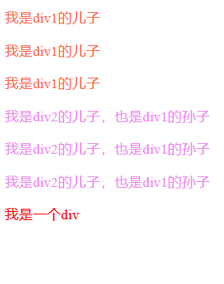
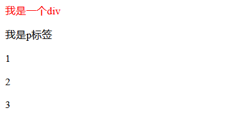

# CSS选择器

> HTML是网页内容的载体。内容就是网页制作者放在页面上想要让用户浏览的信息，可以包含文字、图片、视频等。
> CSS样式是表现。就像网页的外衣。比如，标题字体、颜色变化，或为标题加入背景图片、边框等。所有这些用来改变内容外观的东西称之为表现。
> HTML就像是一个人，而CSS就像是衣服和化妆品，用来装饰HTML。

学习CSS可以分为两部分,一是选择器的使用，二就是对属性的记忆,学习CSS选择器可以**更好的重构网页的样式，增加样式的复用性。**

### 1.标签选择器

作用：根据指定的标签名称, 在当前界面中找到所有该名称的标签, 然后设置属性

格式：

```html
标签名称 { 属性：属性值; }
```

示例：

```html
<!DOCTYPE html>
<html lang="en">
<head>
    <meta charset="UTF-8">
    <meta http-equiv="X-UA-Compatible" content="IE=edge">
    <meta name="viewport" content="width=device-width, initial-scale=1.0">
    <title>Document</title>
    <style>
        div {
            color: red;
        }
        p {
            font-style: italic;
        }
        span {
            color: lightskyblue;
            font-style: italic;
        }
    </style>
</head>
<body>
    <div>我是一个div</div>
    <p>我是一个段落标签</p>
    <span>我是一个span</span>
</body>
</html>
```

显示效果：


### 2.id选择器

作用：根据指定的id名称找到对应的标签，然后设置属性

格式：

```
#id名称 {属性:值;}
```

示例：

```html
<!DOCTYPE html>
<html lang="en">
<head>
    <meta charset="UTF-8">
    <meta http-equiv="X-UA-Compatible" content="IE=edge">
    <meta name="viewport" content="width=device-width, initial-scale=1.0">
    <title>Document</title>
    <style>
        #div1 {
            color: lightslategrey;
        }
        #div2 {
            font-style: italic;
            color: mediumaquamarine;
        }
        p1 {
            color: mediumspringgreen;
        }
    </style>
</head>
<body>
    <div id="div1">我是div1</div>

    <div id="div2">我是div2</div>
    
    <p id="p1"></p>
</body>
</html>
```

结果：


注意点：

- 每一个界面中id的名称都是**不可以重复的** 
- 编写id选择器的时候**一定要记得加上#**   
- 在企业开发中一般情况下如果只是要设置样式，一般**不推荐使用id选择器**，而是选择用**类选择器**，因为**id是留给js的**       

### 3.类选择器

作用：根据指定的类名称找到对应的标签, 然后设置属性

格式：

```
.类名{ 属性:值;}
```

示例：

```
<!DOCTYPE html>
<html lang="en">
<head>
    <meta charset="UTF-8">
    <meta http-equiv="X-UA-Compatible" content="IE=edge">
    <meta name="viewport" content="width=device-width, initial-scale=1.0">
    <title>Document</title>
    <style>
        .div1 {
            color: lightskyblue;
            font-style: italic;
        }
    </style>
</head>
<body>
      <div class="div1">第1个div</div>
      <div class="div1">第2个div</div>
      <div class="div1">第3个div</div>
      <div class="div1">第4个div</div>
      <div class="div1">第5个div</div>
</body>
</html>
```

结果：


注意点：

- 类属性选择器class的名称是**可以重复的**

- 编写class选择器时一定要在类名前加上.

- 类名就是**专门用来给CSS设置样式的**

- 在HTML中每个标签可以由多个类名，这样不重叠的样式属性可以实现到同一个元素上

  ```html
  格式:
  <标签名称 class="类名1 类名2 ...">
  <div class = "div1 div2"> </div>
  ```

### 3.后代选择器

作用：找到指定标签的所有特定后代标签，设置属性

格式：

```
选择器1 选择器2 {属性:值;}
```

示例：

```html
<!DOCTYPE html>
<html lang="en">
<head>
    <meta charset="UTF-8">
    <meta http-equiv="X-UA-Compatible" content="IE=edge">
    <meta name="viewport" content="width=device-width, initial-scale=1.0">
    <title>Document</title>
    <style>
       .div1  p{
           color: lightskyblue;
       } 
       .div1 div {
           color: tomato;
       }
    </style>
</head>
<body>
    <div class="div1">
        <p>第1个p</p>
        <p>第2个p</p>
        <p>第3个p</p>
        <div class="div2">
            <p>第1个</p>
            <p>第2个</p>
            <p>第3个</p>
            <div>我是一个div</div>
        </div>
    </div>
</body>
</html>
```

结果：


注意点：

- 后代选择器使用空格隔开
- 后代不只是**儿子**，也包括**孙子/重孙子**...，只要最终放到指定标签后的都是后代
- 后代选择器不仅仅可以使用标签名称，还可以使用其他选择器

### 4.子代选择器

作用：找到指定标签中所有特定的直接子元素，然后设置属性

格式：

```
选择器1>选择器2 { 属性:值;}
```

示例：

```html
<!DOCTYPE html>
<html lang="en">
<head>
    <meta charset="UTF-8">
    <meta http-equiv="X-UA-Compatible" content="IE=edge">
    <meta name="viewport" content="width=device-width, initial-scale=1.0">
    <title>Document</title>
    <style>
        .div1>p{
            color: tomato;
        }
        .div1>.div2>p {
             color: violet;
        }
        .div1>.div2>div {
            color: red;
        }
    </style>
</head>
<body>
      <div class="div1">
          <p>我是div1的儿子</p>
          <p>我是div1的儿子</p>
          <p>我是div1的儿子</p>
          <div class = "div2">
              <p>我是div2的儿子，也是div1的孙子</p>
              <p>我是div2的儿子，也是div1的孙子</p>
              <p>我是div2的儿子，也是div1的孙子</p>
              <div>我是一个div</div>
          </div>
      </div>
</body>
</html>
```

结果：



注意点：

- 子代选择器**只会查找儿子**，不会查找**其他被嵌套的元素**
- 使用>符号连接，不能用空格，>可以延续下去
- 子元素选择器不仅仅可以使用标签名称, 还可以使用其它选择器

### 5.交集选择器

作用: 给所有选择器选中的标签中, 相交的那部分标签设置属性

格式：

```
选择器1选择器2{属性: 值;}
```

示例：

```html
<!DOCTYPE html>
<html lang="en">
<head>
    <meta charset="UTF-8">
    <meta http-equiv="X-UA-Compatible" content="IE=edge">
    <meta name="viewport" content="width=device-width, initial-scale=1.0">
    <title>Document</title>
    <style>
        div.div1 {
            color: red;
        }
    </style>
</head>
<body>
    <div class="div1">我是一个div</div>
    <p class="div1">我是p标签</p>
    <p class="p1">1</p>
    <p class="p1">2</p>
    <p class="p1">3</p>
</body>
</html>
```

结果：



注意点：

- 选择器和选择器之间没有任何的连接符号
- 选择器可以使用标签名称/id名称/class名称
- 交集选择器仅仅作为了解, 企业开发中用的并不多

### 6.并集选择器

作用: 给所有选择器选中的标签设置属性

格式：

```
选择器1,选择器2{属性:值;}
```

示例：

```html
<!DOCTYPE html>
<html lang="en">
<head>
    <meta charset="UTF-8">
    <meta http-equiv="X-UA-Compatible" content="IE=edge">
    <meta name="viewport" content="width=device-width, initial-scale=1.0">
    <title>Document</title>
    <style>
        div.div1 {
            color: red;
        }
    </style>
</head>
<body>
    <div class="div1">我是一个div</div>
    <p class="div1">我是p标签</p>
    <p class="p1">1</p>
    <p class="p1">2</p>
    <p class="p1">3</p>
</body>
</html>
```

结果：


注意点：

- 并集选择器必须使用,来连接
- 选择器可以使用标签名称/id名称/class名称

### 7.兄弟选择器

1.相邻兄弟选择器 **CSS2**

作用: 给指定选择器后面紧跟的那个选择器选中的标签设置属性
 格式:

 ```
 选择器1+选择器2{属性:值;}
 ```

注意点：

- 相邻兄弟选择器必须通过+连接
- 相邻兄弟选择器只能选中紧跟其后的那个标签, 不能选中被隔开的标签

2.通用兄弟选择器 **CSS3**

作用：给指定选择器后面的所有选择器选中的所有标签设置属性

格式:

```
选择器1~选择器2{属性:值;}
```

注意点：

- 通用兄弟选择器必须用~连接

- 通用兄弟选择器选中的是指定选择器后面某个选择器选中的所有标签, 无论有没有被隔开都可以选中

示例：

```html
<!DOCTYPE html>
<html lang="en">
<head>
    <meta charset="UTF-8">
    <meta http-equiv="X-UA-Compatible" content="IE=edge">
    <meta name="viewport" content="width=device-width, initial-scale=1.0">
    <title>Document</title>
    <style>
        /* css2 */
         .p1+p {
             color: saddlebrown;
         }
         /* css3 */
         .p1~p {
             color:lightskyblue
         }
    </style>
</head>
<body>
    <div>
        <p class="p1">我是p1</p>
        <p>我是p2</p>
        <p>我是p3</p>
    </div>
</body>
</html>
```

结果：

相邻兄弟选择器


通用兄弟选择器


### 8.伪类选择器

#### 8.1序选择器

CSS3中新增的选择器最具代表性的就是序选择器

1.同级别中的第几个元素

| 序选择器           | 描述                                                         |
| ------------------ | ------------------------------------------------------------ |
| :first-child       | 选中同级别中的第一个标签                                     |
| :last-child        | 选中同级别中的最后一个标签                                   |
| :nth-child(n)      | 选中同级别中的第几个标签<br/>:nth-child(odd) 	选中同级别中的所有奇数<br/>:nth-child(even)    选中同级别中的所有偶数<br/>:nth-child(xn+y)    x和y是用户自定义的, 而n是一个计数器, 从0开始递增<br />例如(3n+1)分别对应1,4,7..... |
| :nth-last-child(n) | 选中同级别中的倒数第n个标签                                  |
| :only-child        | 选中父元素仅有的一个子元素E。仅有一个子元素时生效            |

注意点: **不区分类型**

2.同级别同类型中的第几个

| 序选择器             | 描述                              |
| -------------------- | --------------------------------- |
| :first-of-type       | 选中同级别中同类型的第一个标签    |
| :last-of-type        | 选中同级别中同类型的最后一个标签  |
| :nth-of-type(n)      | 选中同级别中同类型的第n个标签     |
| :nth-last-of-type(n) | 选中同级别中同类型的倒数第n个标签 |
| :only-of-type        | 选中父元素的特定类型的唯一子元素  |

示例：

```html
<!DOCTYPE html>
<html lang="en">
<head>
    <meta charset="UTF-8">
    <meta http-equiv="X-UA-Compatible" content="IE=edge">
    <meta name="viewport" content="width=device-width, initial-scale=1.0">
    <title>Document</title>
    <style>
        p:first-child {
            color: lightskyblue;
        }

        p:nth-child(2) {
            color: red;
        }
        p:last-child {
            color: blue;
        }
    </style>
<body>
        <div>
            <p>我是div里面的1p</p>
            <p>我是div里面的2p</p>
            <p>我是div里面的3p</p>
        </div>
        <p class="p1">div外的p1</p>
        <p>div外的p2</p>
        <p class="p1">div外的p3</p>
        <p>div外的p4</p>
</body>
</html>
```

结果：


#### 8.2动态伪类选择器

-  E:link（链接伪类选择器）：选择匹配的E元素，而且匹配元素被定义了超链接并未被访问过。常用于链接		描点上
- E:visited（链接伪类选择器 ）：选择匹配的E元素，而且匹配元素被定义了超链接并已被访问过。常用于		链接描点上
- E:active（用户行为选择器）：选择匹配的E元素，且匹配元素被激活。常用于链接描点和按钮上
- E:hover （用户行为选择器）： 选择匹配的E元素，且用户鼠标停留在元素E上。IE6及以下浏览器仅支持		a:hover

示例：

```
<!DOCTYPE html>
<html lang="en">
<head>
    <meta charset="UTF-8">
    <meta http-equiv="X-UA-Compatible" content="IE=edge">
    <meta name="viewport" content="width=device-width, initial-scale=1.0">
    <title>Document</title>
    <style>
        /* 给a标签从未访问过的时候设置样式 */
        a:link {
            color:blue;
            text-decoration: none;
        }
        /* 已经访问过 */
        a:visited {
            color: red;
        } 
        /* 悬停 */
        a:hover {
            color: yellow;
        }
        a:active {
            color: black;
        } 
    </style>
</head>
<body>
    <a href="https://www.tmall.com/">爱奇艺</a>
</body>
</html>
```

结果

a:link


a:visited


a:hover


a:active


#### 8.3否定伪类

作用：可以从已选中的元素中剔除出某些元素

格式：

```
:not(选择器)
```

示例：

```
<!DOCTYPE html>
<html lang="en">
<head>
    <meta charset="UTF-8">
    <meta http-equiv="X-UA-Compatible" content="IE=edge">
    <meta name="viewport" content="width=device-width, initial-scale=1.0">
    <title>Document</title>
    <style>
        p:not(.p1) {
            background-color: tomato;
        }
    </style>
</head>
<body>
    <!-- 否定伪类 -->
    <p>我是第1个段落标签</p>
    <p class="p1">我是第2个段落标签</p>
    <p>我是第3个段落标签</p>
    <p>我是第4个段落标签</p>
</body>
</html>
```

结果：


#### 8.4伪元素选择器

作用：使用微元素表示元素中的一些特殊的位置

- ::after

  表示元素的最后边的部分
   一般需要结合content这个样式一起使用，
   通过content可以向after的位置添加一些内容

- ::before

  表示元素最前边的部分
   一般需要结合content这个样式一起使用，
   通过content可以向before的位置添加一些内容  

- ::first-letter

  为第一个字符来设置一个样式

- ::first-line   

  为第一行设置一个样式

示例：

```html
<!DOCTYPE html>
<html lang="en">
<head>
    <meta charset="UTF-8">
    <meta http-equiv="X-UA-Compatible" content="IE=edge">
    <meta name="viewport" content="width=device-width, initial-scale=1.0">
    <title>Document</title>
    <style>
        /* ...之后 */
        p::after{
            content: "我是一个：：after";
        }
        /* ...之前 */
        p::before{
            content: "我是一个：：before";
        }
        /* 首字母被选中  由：：before则是before的文本内容*/
        p::first-letter {
            font-size: 30px;
            color: tomato;
        }
        p::first-line {
            color: blue;
        }
    </style>
</head>
<body>
    <p>
        作用: 找到有指定属性, 并且属性的取值等于value的标签, 然后设置属性
        最常见的应用场景, 就是用于区分input属性
    </p>
</body>
</html>
```

结果：


注意：当浏览器缩放到几行的时候，first-line只选择这个段落的第一行


#### 8.5属性选择器

作用:根据指定的属性名称找到对应的标签, 然后设置属性

格式:

```
[attribute]
[attribute=value]
```

作用: 找到有指定属性, 并且属性的取值等于value的标签, 然后设置属性
最常见的应用场景, 就是用于区分input属性

```html
input[type=password]{}
<input type="text" name="" id="">
<input type="password" name="" id="">
```

- 属性的取值是以什么开头的
  ​        	[attribute|=value] CSS2
  ​        	[attribute^=value] CSS3
  ​            两者之间的区别:
  ​        	CSS2中的只能找到value开头,并且value是被-和其它内容隔开的
  ​        	CSS3中的只要是以value开头的都可以找到, 无论有没有被-隔开

- 属性的取值是以什么结尾的
  ​        	[attribute$=value] CSS3

- 属性的取值是否包含某个特定的值得
  ​        	[attribute~=value] CSS2
  ​        	[attribute*=value] CSS3
  ​             两者之间的区别:
  ​        	CSS2中的只能找到独立的单词, 也就是包含value,并且value是被空格隔开的
  ​        	CSS3中的只要包含value就可以找到

示例：

```
<!DOCTYPE html>
<html lang="en">
<head>
    <meta charset="UTF-8">
    <meta http-equiv="X-UA-Compatible" content="IE=edge">
    <meta name="viewport" content="width=device-width, initial-scale=1.0">
    <title>Document</title>
    <style>
        /* 通配符选择器 */
        *{
            margin: 0;
            padding: 0;
        }
        /* 属性选择器 */
        input[type=text] {
            background-color: red;
        }
        /* 获取属性开头选择特定的标签 */
        /* css2 */
        input[name|=user] {
            color: blue;
        }
        /* css3 */
        input[name^=user] {
            color: blue;
        }
        /* 直接加abc */
        input[abc] {
            background-color: lightskyblue;
        }
    </style>
</head>
<body>
    <input type="text" name="user-name" id=""><br>
    <input type="text" name="" id=""><br>
    <input type="password" name="username" id=""><br>
    <input type="text" abc>
</body>
</html>
```

结果：


### 9.通配符选择器

作用：给当前界面上所有的标签设置属性

格式：

```
*{属性:值;}
```

注意点:
        	由于通配符选择器是设置界面上所有的标签的属性, 所以在设置之前会遍历所有的标签, 如果当前界面上的标签比较多, 那么性能就会比较差, 所以在企业开发中一般不会使用通配符选择器

