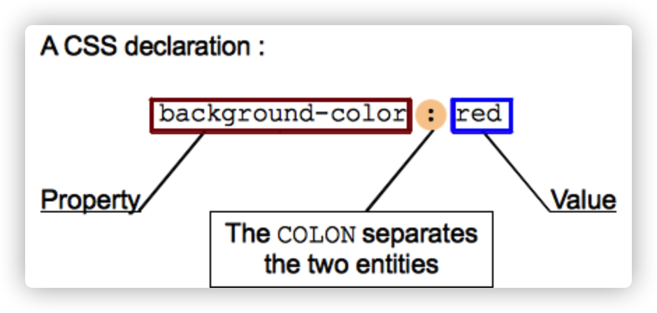
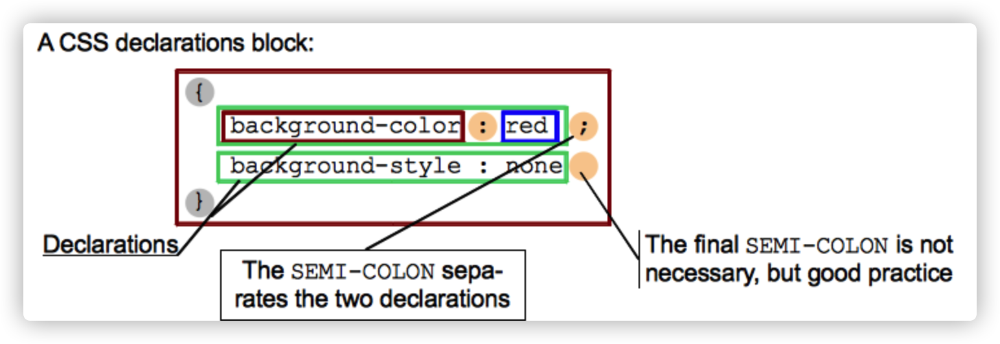
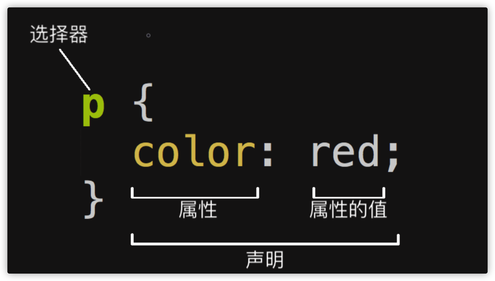

## 1.CSS3

- 什么是CSS
  	CSS (Cascading Style Sheets) 层叠样式表，是一个用于修饰文档（可以是标记语言HTML，也可以是XML或者SVN）的语言，可以将文档以更优雅的形式呈现给用户。
- HTML和CSS之间的关系？
      HTML是网页内容的载体。内容就是网页制作者放在页面上想要让用户浏览的信息，可以包含文字、图片、视频等。
       CSS样式是表现。就像网页的外衣。比如，标题字体、颜色变化，或为标题加入背景图片、边框等。所有这些用来改变内容外观的东西称之为表现。
       HTML就像是一个人，而CSS就像是衣服和化妆品，用来装饰HTML。
- 通过标签来修改样式的缺点:
      需要记忆哪些标签有哪些属性, 如果该标签没有这个属性, 那么设置了也没有效果。
      当需求变更时我们需要修改大量的代码才能满足现有的需求。
      HTML只有一个作用就是用来添加语义。
- 通过CSS来修改样式有什么好处?
      不用记忆哪些属性属于哪个标签。
      当需求变更时我们不需要修改大量的代码就可以满足需求。
      在前端开发中CSS只有一个作用, 就是用来修改样式。

## 2.语法

#### 2.1.CSS声明（CSS declarations）       

​	CSS语言的核心功能就是为特定的属性设定特定的值，CSS引擎通过计算出声明的每个属性来显示元素。CSS的属性和值都是大小写敏感的。属性与值通过“:”分隔开。并不是所有的值都适用于同一个属性，不同的属性有一系列不同的值。



##### 2.2.CSS声明块（ CSS declaration blocks）

将多个CSS声明写在一起，每个CSS声明通过“;”分隔开，最后一个css声明无需使用“;”分隔开。使用“{”“}”将多个CSS声明括起来，这样就构成了一个CSS声明块。



##### 2.3.CSS规则集



**选择器（Selector）**HTML 元素的名称位于规则集开始。它选择了一个或多个需要添加样式的元素（在这个例子中就是 p 元素）。要给不同元素添加样式只需要更改选择器就行了。

**声明（Declaration）**一个单独的规则，如 color: red; 用来指定添加样式元素的属性。

**属性（Properties）**改变 HTML 元素样式的途径。（本例中 color 就是 <p> 元素的属性。）CSS 中，由编写人员决定修改哪个属性以改变规则。

**属性的值（Property value）**在属性的右边，冒号后面即属性的值，它从指定属性的众多外观中选择一个值（我们除了 red 之外还有很多属性值可以用于 color ）。

**注意其他重要的语法：**每个规则集（除了选择器的部分）都应该包含在成对的大括号里（{}）。在每个声明里要用冒号（:）将属性与属性值分隔开。 在每个规则集里要用分号（;）将各个声明分隔开。

#### 2.4.CSS可读性

##### 空白（ White space）	

空白意味着实际空格、制表符和新行，可以添加空白使样式表更加可读。

##### 注释（ Comments）	

/* 这里就是CSS的注释 */

##### 速记写法（ Shorthand）

类似于font，background， padding， border， margin 这些都被称为速记属性。

这些属性允许在一行中写多个属性值。速记属性可以节省时间，使代码整洁。

例如：

border:1px solid red;  

background-color:red;

padding: 10px 15px 15px 5px;等价于padding-top: 10px; padding-right: 15px; padding-bottom: 15px; padding-left: 5px;

## 3.CSS的引入方式

#### - 内联样式(行内样式)

缺点：样式与结构冗余

优点：优先级较高

内联样式表就是把css代码直接写在现有的HTML标签中，具体的使用方法如下面所示：

```html
<div style="color:red">设置文字的颜色为红色</div>
```

这里要注意：样式的内容写在元素的开始标签里，并且css样式代码要写在style=""双引号中，如果有多条css样式代码设置可以写在一起，中间用分号隔开。多个css样式写在一起的效果如下面所示：

```html
<div style="color:red;font-size:14px">
    设置字体颜色为红色，并且字体大小为14px
</div>
```

这种样式只会对当前标签起作用，在测试的时候可以使用，不能对样式进行复用，不方便后期维护，不推荐使用

#### - 内部样式表

缺点：样式的复用率较低

优点：样式与结构分离

将样式表编写到head中的style标签中

```html
<style type="text/css">    
  p{        
    color:red;        
    background-color:yellow;    
  }
</style>
```

使用内部样式表，进一步将表现和结构分离，可以同时为多个元素设置样式，方便后期的维护
注意点:
    -style标签要写在head标签的开始标签和结束标签之间(也就是和title标签是兄弟关系)

​    -style标签中的type属性其实可以不用写, 默认就是type="text/css"

​    -设置样式时必须按照固定的格式来设置. key: value;其中:不能省略, 分号大多数情况下也不能省略

#### - 外部样式表

优点：样式与结构分离，解耦；样式的复用率高（框架:例如bootstrap）， 共用，定义好的css文件可以应用到多个页面中。

1.将样式表编写到外部的CSS文件中，然后通过link标签将外部文件引入

```html
<link rel="stylesheet" type="text/css" href="文件的路径"/>
```

将样式编写到外部样式表中，可以在不同的页面中使用同一个样式表，完全将表现和结构分离，方便后期的维护，推荐使用的方式

2.@import url()，还可通过import方式导入CSS文件

 @import引入方式会先加载html，再加载css；当网络环境较差时，会出导致页面效果较差的现象，所以该方式不建议使用；

```css
<style>
	/*要写在style标签的最前面，否则不会生效 或者直接在外部css文件中直接使用*/
  @import url('./style.css');
</style>
```

##### - 引入方式的优先级

行内样式>内部样式/外部引入

就近原则：哪一种设置方式距离元素最近，谁的优先级更高；

##### - CSS怎么学?

CSS的学习一共分为两大部分, 一个是CSS的选择器, 另一个是CSS的属性.

## 4.CSS选择器

#### - 标签选择器

​		作用: 根据指定的标签名称, 在当前界面中找到所有该名称的标签, 然后设置属性
​        格式:
​            标签名称{
​                属性:值;
​            }
​        注意点:
​        	1.标签选择器选中的是当前界面中所有的标签, 而不能单独选中某一个标签
​        	2.标签选择器无论标签藏得多深都能选中
​        	3.只要是HTML中的标签就可以作为标签选择器(h/a/img/ul/ol/dl/input....)

#### - id选择器

​		作用: 根据指定的id名称找到对应的标签, 然后设置属性
​		格式:
​        	#id名称{
​            	属性:值;
​        	}
​    	注意点:
​    		1.每个HTML标签都有一个属性叫做id, 也就是说每个标签都可以设置id
​    		2.在同一个界面中id的名称是不可以重复的
​    		3.在编写id选择器时一定要在id名称前面加上#
​    		4.id的名称是有一定的规范的
​    			4.1 id的名称只能由字母/数字/下划线，a-z 0-9 _ 
​    			4.2 id名称不能以数字开头
​    			4.3 id名称不能是HTML标签的名称，不能是a h1 img input ...
​    		5.在企业开发中一般情况下如果仅仅是为了设置样式, 我们不会使用id ,因为id是留给js使用的

#### - 类选择器

​		作用: 根据指定的类名称找到对应的标签, 然后设置属性
​		格式:
​        	.类名{
​            	属性:值;
​        	}

​		注意点:
​    		1.每个HTML标签都有一个属性叫做class, 也就是说每个标签都可以设置类名
   		 2.在同一个界面中class的名称是可以重复的
​    		3.在编写class选择器时一定要在class名称前面加上.
​    		4.类名的命名规范和id名称的命名规范一样
   		 5.类名就是专门用来给CSS设置样式的
​    		6.在HTML中每个标签可以同时绑定多个类名
​    	格式:
​    		<标签名称 class="类名1 类名2 ...">
​    	错误的写法:

```html
	   <p class="para1" class="para2">
```

​			7.id和class的区别?
​        		7.1 id相当于人的身份证不可以重复
​         	          class相当于人的名称可以重复

​        		7.2 一个HTML标签只能绑定一个id名称
​                       一个HTML标签可以绑定多个class名称

​    		8.id选择器和class选择器区别?
​        		id选择器是以#开头
​        		class选择器是以.开头

​    		9.在企业开发中到底用id选择器还是用class选择器?
​        		id一般情况下是给js使用的, 所以除非特殊情况, 否则不要使用id去设置样式

​    		10.在企业开发中一个开发人员对类的使用可以看出这个开发人员的技术水平
​        		一般情况下在企业开发中要注重冗余代码的抽取, 可以将一些公共的代码抽取到一个类选择器中, 然后				让标签和这个类选择器绑定即可

#### - 后代选择器

​		作用: 找到指定标签的所有特定的后代标签, 设置属性
​    	格式:
​        	标签名称1 标签名称2{
​            	属性:值;
​        	}
​    	先找到所有名称叫做"标签名称1"的标签, 然后再在这个标签下面去查找所有名称叫做"标签名称2"的标签, 		然后在设置属性
​    	例如：div p{}

​    	注意点:
​    		1.后代选择器必须用空格隔开
​    		2.后代不仅仅是儿子, 也包括孙子/重孙子, 只要最终是放到指定标签中的都是后代
​    		3.后代选择器不仅仅可以使用标签名称, 还可以使用其它选择器
​    		4.后代选择器可以通过空格一直延续下去

#### - 子元素选择器

​		作用: 找到指定标签中所有特定的直接子元素, 然后设置属性
​		格式:
​        	标签名称1>标签名称2{
​           	 属性:值;
​        	}

​		注意点:
​    		1.子元素选择器只会查找儿子, 不会查找其他被嵌套的标签
​    		2.子元素选择器之间需要用>符号连接, 并且不能有空格
​    		3.子元素选择器不仅仅可以使用标签名称, 还可以使用其它选择器
​    		4.子元素选择器可以通过>符号一直延续下去

​    		5.后代选择器和子元素选择器之间的区别?
​        		-后代选择器使用空格作为连接符号
​         		子元素选择器使用>作为连接符号
​        		-后代选择器会选中指定标签中, 所有的特定后代标签, 也就是会选中儿子/孙子..., 只要是被放到指定标				签中的特 定标签都会被选中
​        		 子元素选择器只会选中指定标签中, 所有的特定的直接标签, 也就是只会选中特定的儿子标签

​			 6.后代选择器和子元素选择器之间的共同点
​    			-后代选择器和子元素选择器都可以使用标签名称/id名称/class名称来作为选择器
​    			-后代选择器和子元素选择器都可以通过各自的连接符号一直延续下去
​     			选择器1>选择器2>选择器3>选择器4{}
​			  7.在企业开发中如何选择
​    		 	如果想选中指定标签中的所有特定的标签, 那么就使用后代选择器
​     			如果只想选中指定标签中的所有特定儿子标签, 那么就使用子元素选择器

#### - 交集选择器

​		作用: 给所有选择器选中的标签中, 相交的那部分标签设置属性
​		格式:
​        	选择器1选择器2{
​            	属性: 值;
​       	 }
​		注意点:
​    		1.选择器和选择器之间没有任何的连接符号
​    		2.选择器可以使用标签名称/id名称/class名称
​    		3.交集选择器仅仅作为了解, 企业开发中用的并不多

#### - 并集选择器

​		作用: 给所有选择器选中的标签设置属性
​		格式:
​			选择器1,选择器2{
​            	属性:值;
​        	}
​    	注意点:
​    		1.并集选择器必须使用,来连接
​    		2.选择器可以使用标签名称/id名称/class名称

#### - 兄弟选择器

​		1.相邻兄弟选择器 CSS2
​    	作用: 给指定选择器后面紧跟的那个选择器选中的标签设置属性
​    	格式:
​        	选择器1+选择器2{
​           	 属性:值;
​        	}
​    	注意点:
​        	1.相邻兄弟选择器必须通过+连接
​        	2.相邻兄弟选择器**只能选中紧跟其后**的那个标签, 不能选中被隔开的标签

​    	2.通用兄弟选择器 CSS3
​    		作用: 给指定选择器后面的**所有选择器选中**的所有标签设置属性
​    		格式:
​        		选择器1~选择器2{
​            		属性:值;
​       		}
   	 注意点:
​        	1.通用兄弟选择器**必须用~连接**
​        	2.通用兄弟选择器选中的是**指定选择器后面某个选择器选中的所有标签**, 无论有没有被隔开都可以选中

#### - 伪类选择器

​		伪类以":"开头，用在选择器后，用于指明元素在某种特殊的状态下才能被选中

#### - 序选择器（结构伪类选择器）

​		CSS3中新增的选择器最具代表性的就是序选择器
​        	1.同级别中的第几个
​        		:first-child 			选中同级别中的第一个标签
​        		:last-child 			 选中同级别中的最后一个标签
​       		 :nth-child(n) 		 选中同级别中的第n个标签
​           	 		:nth-child(odd) 	选中同级别中的所有奇数
​            			:nth-child(even)    选中同级别中的所有偶数
​           	 		:nth-child(xn+y)    x和y是用户自定义的, 而n是一个计数器, 从0开始递增

​						例如(3n+1)分别对应1,4,7.....
​        		:nth-last-child(n)   选中同级别中的倒数第n个标签
​        		:only-child 			 选中父元素仅有的一个子元素E。仅有一个子元素时生效
​        		注意点: 不区分类型
​        
​        	2.同级别同类型中的第几个
​        		:first-of-type 选中同级别中同类型的第一个标签
​        		:last-of-type  选中同级别中同类型的最后一个标签
​        		:nth-of-type(n) 选中同级别中同类型的第n个标签
​        		:nth-last-of-type(n)  选中同级别中同类型的倒数第n个标签
​        		:only-of-type 选中父元素的特定类型的唯一子元素

#### - 动态伪类选择器

​		E:link（链接伪类选择器）：选择匹配的E元素，而且匹配元素被定义了超链接并未被访问过。常用于链接		描点上
​		E:visited（链接伪类选择器 ）：选择匹配的E元素，而且匹配元素被定义了超链接并已被访问过。常用于		链接描点上
​		E:active（用户行为选择器）：选择匹配的E元素，且匹配元素被激活。常用于链接描点和按钮上
​        E:hover （用户行为选择器）： 选择匹配的E元素，且用户鼠标停留在元素E上。IE6及以下浏览器仅支持		a:hover

#### - a标签的伪类选择器

​		1.通过我们的观察发现a标签存在一定的状态
​            1.1默认状态, 从未被访问过
​            1.2被访问过的状态
​            1.3鼠标长按状态
​            1.4鼠标悬停在a标签上状态
​        2.格式
​            :link 修改从未被访问过状态下的样式
​            :visited 修改被访问过的状态下的样式
​            :hover 修改鼠标悬停在a标签上状态下的样式
​            :active 修改鼠标长按状态下的样式
​        3.注意点
​            3.1 a标签的伪类选择器可以单独出现也可以一起出现
​            3.2 a标签的伪类选择器如果一起出现, 那么有严格的顺序要求
​                默认状态:**link->被访问状态:visited->鼠标悬停状态:hover->鼠标长按状态:active**
​                编写的顺序必须要遵守爱恨原则 **love hate**
​            3.3 如果默认状态的样式和被访问过状态的样式一样, 那么可以缩写 

```html
/* 简写格式 */
a{
    color: green;
}
/* link:和 :visited样式一样，可以写成以上的简写格式，代码量减少，开发效率提高*/
/*a:link{*/
    /*color: green;*/
/*}*/
/*a:visited{*/
    /*color: green;*/
/*}*/
```


#### - 否定伪类

​		作用：可以从已选中的元素中剔除出某些元素
​        语法：
​            :not(选择器)
​        例如:
​        	p:not(.hello){
​           	 background-color: yellow;
​        	}

#### - 伪元素选择器

​		使用伪元素来表示元素中的一些特殊的位置
​		::after
​        		表示元素的最后边的部分
​        		一般需要结合content这个样式一起使用，
​        		通过content可以向after的位置添加一些内容
   	 ::before
​        		表示元素最前边的部分
​        		一般需要结合content这个样式一起使用，
​        		通过content可以向before的位置添加一些内容     
​    	::first-letter
​        		为第一个字符来设置一个样式
​    	::first-line    
​        		为第一行设置一个样式

#### - 属性选择器

​		作用: 根据指定的属性名称找到对应的标签, 然后设置属性
​    	格式:
​        	[attribute]

​		[attribute=value]
​    		作用: 找到有指定属性, 并且属性的取值等于value的标签, 然后设置属性
​    		最常见的应用场景, 就是用于区分input属性

```html
input[type=password]{}
<input type="text" name="" id="">
<input type="password" name="" id="">
```

​		-属性的取值是以什么开头的
​        	[attribute|=value] CSS2
​        	[attribute^=value] CSS3

```html
<input type="text" name="user-name" id="">
<input type="password" name="username" id="">
```

​        两者之间的区别:
​        	CSS2中的只能找到value开头,并且value是被-和其它内容隔开的
​        	CSS3中的只要是以value开头的都可以找到, 无论有没有被-隔开

​		-属性的取值是以什么结尾的
​        	[attribute$=value] CSS3

​		-属性的取值是否包含某个特定的值得
​        	[attribute~=value] CSS2
​        	[attribute*=value] CSS3
​        两者之间的区别:
​        	CSS2中的只能找到独立的单词, 也就是包含value,并且value是被空格隔开的
​        	CSS3中的只要包含value就可以找到

#### - 通配符选择器

​		作用: 给当前界面上所有的标签设置属性
​		格式:
​        	*{
​            	属性:值;
​        	}
​		注意点:
​        	由于通配符选择器是设置界面上所有的标签的属性, 所以在设置之前会遍历所有的标签, 如果**当前界面上			的标签比较多, 那么性能就会比较差**, 所以在企业开发中一般不会使用通配符选择器

#### - 组合选择器      

​		多个选择器组合使用。例如 "div.one" 表示class为one的div元素

## 5.CSS三大特性

#### - 继承性

​        作用: 给父元素设置一些属性, 子元素也可以使用, 这个我们就称之为继承性
​        注意点:
​        	1.并不是所有的属性都可以继承, 只有以**color/font-/text-/line-开头的属性才可以继承**
​        	2.在CSS的继承中不仅仅是儿子可以继承, 只要是后代都可以继承
​        	3.继承性中的特殊性
​            	3.1 **a标签的文字颜色和下划线是不能继承的,当做子元素**
​            	3.2 **h标签的文字大小是不能继承的，在做子元素**

```html
<div>
  <a href="https://www.baidu.com">百度一下</a>
  <p>我是p标签</p>
  <h1>我是h1标签</h1>
</div>
```

​    	应用场景:
​    		一般用于设置网页上的一些共性信息, 例如网页的文字颜色, 字体,文字大小等内容

#### - 层叠性

​    	作用: 层叠性就是CSS处理冲突的一种能力
​    	注意点:
   		 层叠性只有在多个选择器选中"同一个标签", 然后又设置了"相同的属性", 才会发生层叠性

#### - 优先级

​    	作用:当多个选择器选中同一个标签, 并且给同一个标签设置相同的属性时, 如何层叠就由优先级来确定

#####     	- 优先级判断的三种方式

​        	-间接选中就是指继承
​        	**如果是间接选中, 那么就是谁离目标标签比较近就听谁的**

​        	-相同选择器(直接选中)
​        	**如果都是直接选中, 并且都是同类型的选择器, 那么就是谁写在后面就听谁的**

​       	 -不同选择器(直接选中)
​        	**如果都是直接选中, 并且不是相同类型的选择器, 那么就会按照选择器的优先级来层叠**
​       	 id>类>标签>通配符>继承>浏览器默认

#####     	-优先级之!important

​        	作用: 用于提升某个直接选中标签的选择器中的某个属性的优先级的, 可以将被指定的属性的优先级提升			为最高

​        	注意点:
​        		1.!important只能用于直接选中, 不能用于间接选中
​        		2.通配符选择器选中的标签也是直接选中的
​        		3.!important只能提升被指定的属性的优先级, 其它的属性的优先级不会被提升
​        		4.!important必须写在属性值的后面，分号前面
​        		5.!important前面的感叹号不能省略
​        		6.但是一般建议不使用"!important",因为它会改变级联的工作方式，使得调试变得困难。

#####     	- 优先级权重

​        	作用: 当多个选择器混合在一起使用时, 我们可以通过计算权重来判断谁的优先级最高

​        	-权重的计算规则
​            		内联样式，如: style="..."，权值为1000。
​            		ID选择器，如：#content，权值为0100。
​            		类，伪类、属性选择器，如.content，权值为0010。
​            		标签选择器、伪元素选择器，如div p，权值为0001。
​            		通配符、复合选择器（+、>、~等）、否定伪类（：not）没有影响，权值为0000。
​            		继承的样式没有权值

​            	-首先**先计算选择器中有多少个id**, id多的选择器优先级最高
​            	-如果**id的个数一样, 那么再看类名的个数**, 类名个数多的优先级最高
​            	-如果类名的个数一样, 那么再看**标签名称的个数**, 标签名称个数多的优先级最高
​            	-如果id个数一样, 类名个数也一样, 标签名称个数也一样, **那么就不会继续往下计算了, 那么此时谁写				在后面听谁的**

​            	也就是说优先级如果一样, 那么谁写在后面听谁的

​        注意点:
​        1.只有选择器是直接选中标签的才需要计算权重, 否则一定会听直接选中的选择器的