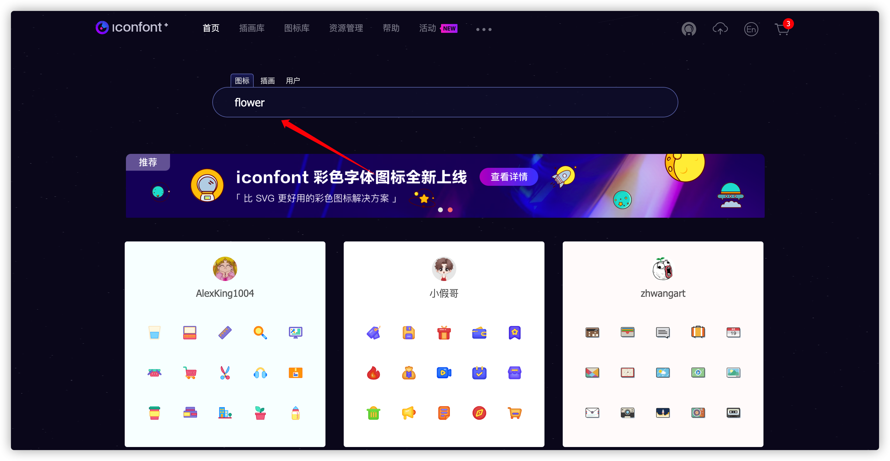
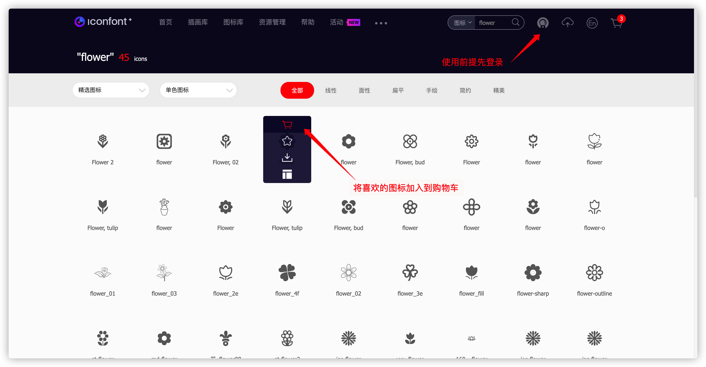
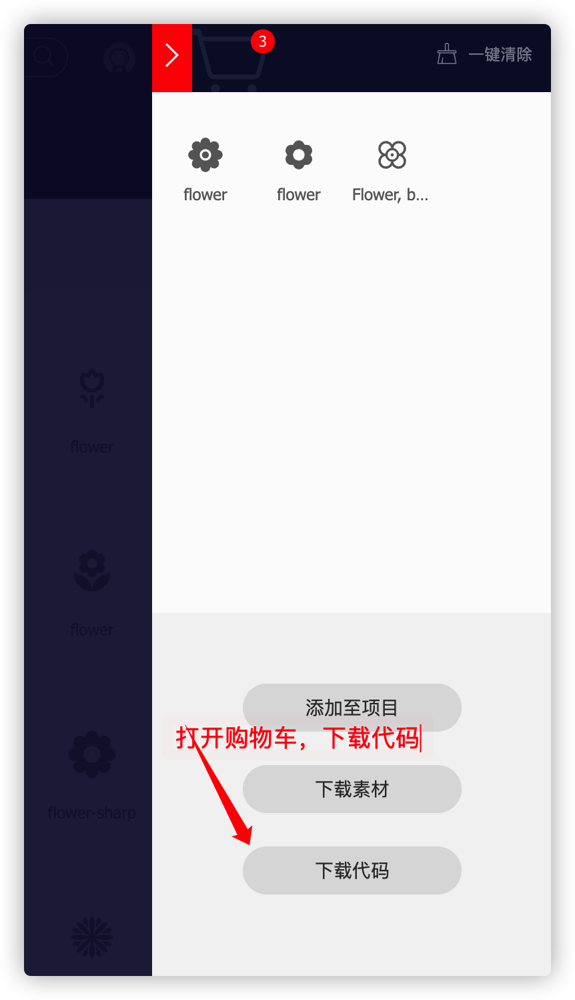
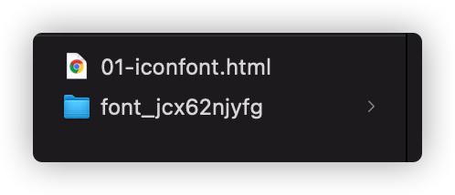
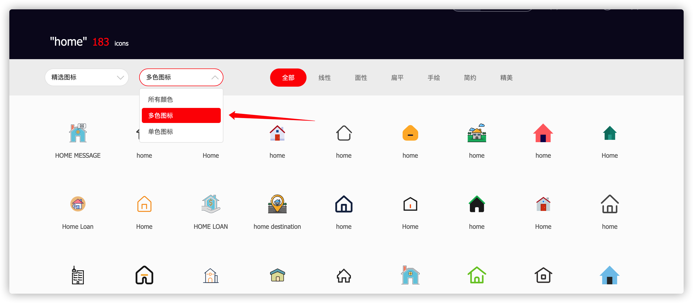
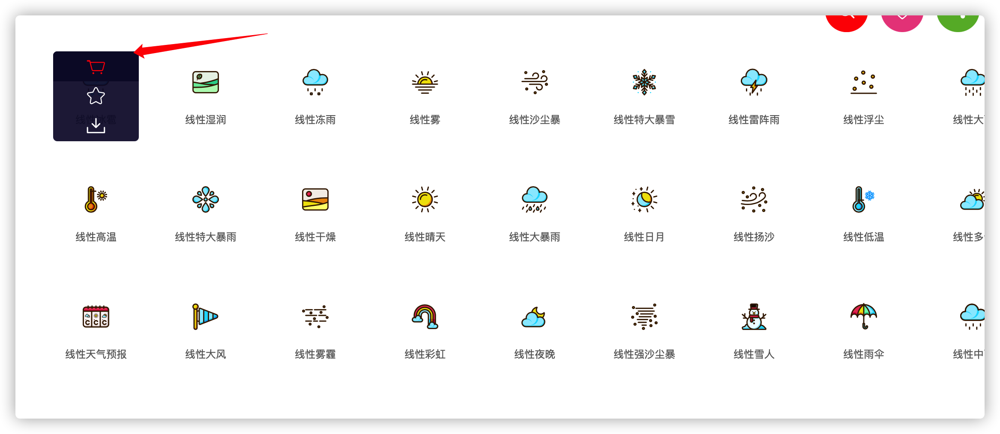
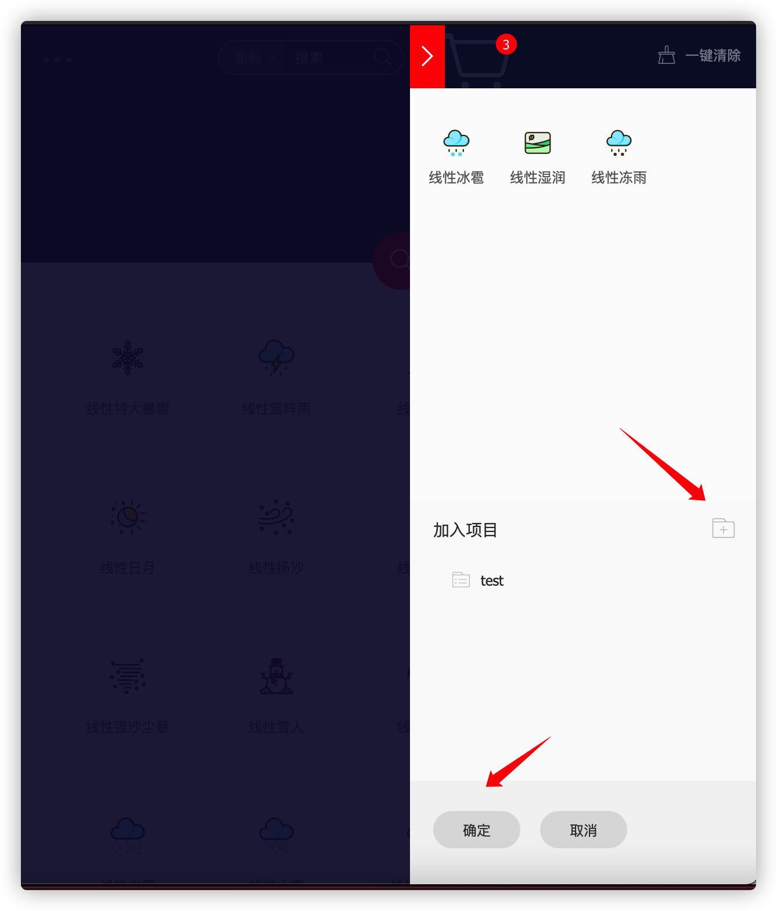
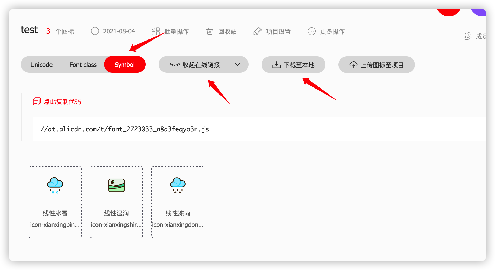

## 1.文本属性

> ##### 文本属性-概览
>
> ##### color  为字体指定颜色
>
> ##### font-style	用于打开和关闭斜体文本
>
> ##### font-weight	为字体设置粗细程度
>
> ##### font-size  为文字指定大小
>
> ##### font-family  为文字指定特殊的字体，浏览器只会使用浏览器可以访问到的字体
>
> ##### webFont 网络字体
>
> ##### 字体图标
>
> ##### text-decoration  设置或者取消文本修饰
>
> ##### text-align  文字排列方式
>
> ##### text-indent 文本缩进属性
>
> ##### text-transform  设置或者取消字体改变
>
> ##### text-shadow   设置或者取消文本阴影

#### - 颜色属性

##### 在CSS中如何通过color属性来修改文字颜色

格式: color: 值;
取值:

- ##### 英文单词

​		一般情况下常见的颜色都有对应的英文单词, 但是英文单词能够表达的颜色是有限制的, 也就是说不是所有的颜色都能够通过英文单词来表达

- ##### rgb

​		rgb其实就是三原色, 其中r(red 红色) g(green 绿色) b(blue 蓝色)
​		格式: rgb(0,0,0)
​		那么这个格式中的
​            	第一个数字就是用来设置三原色的光源元件红色显示的亮度
​            	第二个数字就是用来设置三原色的光源元件绿色显示的亮度
​            	第三个数字就是用来设置三原色的光源元件蓝色显示的亮度
​            	这其中的每一个数字它的取值是0-255之间, 0代表不发光, 255代表发光, 值越大就越亮

​            	红色: rgb(255,0,0);
​            	绿色: rgb(0,255,0);
​            	蓝色: rgb(0,0,255);
​            	黑色: rgb(0,0,0);
​            	白色: rgb(255,255,255);

​		在前端开发中其实并不常用黑色
​        只要让红色/绿色/蓝色的值都一样就是灰色
​        而且如果这三个值越小那么就越偏黑色, 越大就越偏白色
​        例如: color: rgb(200,200,200);

- ##### rgba

​		rgba中的rgb和前面讲解的一样, 只不过多了一个a
​		那么这个a呢代表透明度, 取值是0-1, 取值越小就越透明
​		例如: color: rgba(255,0,0,0.2);

- ##### 十六进制

​		在前端开发中通过十六进制来表示颜色, 其实本质就是RGB
​		十六进制中是通过每两位表示一个颜色
​		例如: #FFEE00 FF表示R EE表示G 00表示B

#### - font-style	用于打开和关闭斜体文本

​	格式：font-style: italic;
​    取值：
​        normal ： 正常的， 默认就是正常的
​        italic :  倾斜的
​        快捷键：
​        fs font-style: italic;
​        fsn font-style: normal;

#### - font-weight	为字体设置粗细程度

​	格式： font-weight: bold;
​    取值:
​         bold 加粗
​         bolder  比加粗还要粗
​         lighter 细线， 默认就是细线
​     数字取值：
​         100-900之间整百的数字
​         400 等同于 normal
​         700 等同于 bold

​      快捷键
​         fw font-weight:;
​         fwb font-weight: bold;
​         fwbr  font-weight: bolder;

#### - font-size  为文字指定大小

​	格式：font-size: 30px;
​    单位：px（像素 pixel）
​    	注意点： 通过font-size设置大小一定要带单位， 也就是一定要写px
​    快捷键
​         fz font-size:;
​        fz30 font-size: 30px;

#### - font-family  为文字指定特殊的字体，浏览器只会使用浏览器可以访问到的字体

​	格式：font-family:"楷体";

​    通用字体 (直接使用，不需要加引号)
​         serif:有衬线的字体,笔画结尾有特殊的装饰线或衬线
​         sans-serif:无衬线的字体，笔画结尾是平滑的字体
​         monospace:等宽字体，用于代码，字体中每个字宽度相同
​         cursive:草书，这种字体有的有连笔，有的还有特殊的斜体效果。
​         fantasy:装饰字体 ，具有特殊艺术效果的字体

​     注意点：
​         1.如果取值是中文，需要用双引号或者单引号括起来，多个单词组合也要加
​         2.设置的字体必须是用户电脑里面已经安装的字体
​         3.如果设置的字体不存在, 那么系统会使用默认的字体来显示默认使用宋体
​         4.如果设置的字体不存在, 而我们又不想用默认的字体来显示怎么办?
​        	    可以给字体设置备选方案
​        	    格式:font-family:"字体1", "备选方案1", ...;
​          5.如果想给中文和英文分别单独设置字体, 怎么办?
​        		但凡是中文字体, 里面都包含了英文
​        		但凡是英文字体, 里面都没有包含中文
​        		也就是说中文字体可以处理英文, 而英文字体不能处理中文
​        		注意点: 如果想给界面中的英文单独设置字体, 那么英文的字体必须写在中文的前面
​          6.补充在企业开发中最常见的字体有以下几个
​        		中文: 宋体/黑体/微软雅黑
​        		英文: "Times New Roman"/Arial

​        		还需要知道一点, 就是并不是名称是英文就一定是英文字体
​        		因为中文字体其实都有自己的英文名称, 所以是不是中文字体主要看能不能处理中文
​        			宋体 SimSun
​        			黑体 SimHei
​        			微软雅黑 Microsoft YaHei

​        	 快捷键
​        	 	ff font-family:;

#### - 缩写格式

​      缩写格式:
​           font:style weight size family;
​           例如:
​           font:italic bold 10px "楷体";

​           注意点:
​           1.在这种缩写格式中有的属性值可以省略
​           	sytle可以省略
​           	weight可以省略
​           2.在这种缩写格式中style和weight的位置可以交换
​           3.在这种缩写格式中有的属性值是不可以省略的
​           	size不能省略
​           	family不能省略
​           4.size和family的位置是不能随便乱放的
​           	size一定要写在family的前面, 而且size和family必须写在所有属性的最后

#### - WebFont

https://www.ziti163.com/webfont/
当用户电脑中没有安装对应字体的时候，webFont可以加载网络字体进行显示。

```css
@font-face {            
    font-family: 'myfont';          
    src: url(“/fonts/test.woff”), url("/fonts/test.ttf");       
}       
div {           
    font-family: myfont;        
}
<div>        
  test  
</div>
```

#### - 字体图标

​        在开发网站的时候需要各种各样的小图标，这些图标如果要求美工绘制可能比较麻烦，那么我们可以直接使用开源的字体图标库，这些字体图标库使用webFont原理，我们加载一个图标就好像加载一个字体一样简单，通过控制字体大小，字体颜色来控制图标的大小与颜色。
​        目前比较流行的开源字体图标库有
​        iconfont        http://www.iconfont.cn/
​        font-awesome    http://fontawesome.dashgame.com/

##### -iconfont使用步骤

1.打开iconfont网站https://www.iconfont.cn/


2.搜索要使用的图标



3.将喜欢的图标加入到购物车，前提是需要登录iconfont



4.打开购物车，下载代码到本地



5.下载后，将对应的文件夹放到项目目录下



6.在对应的页面中，通过link标签引入iconfont.css，直接根据对应的类名使用即可

```html
<!DOCTYPE html>
<html lang="en">
<head>
  <meta charset="UTF-8">
  <meta http-equiv="X-UA-Compatible" content="IE=edge">
  <meta name="viewport" content="width=device-width, initial-scale=1.0">
  <title>Document</title>
  <!-- 引入对应的iconfont.css -->
  <link rel="stylesheet" href="./font_jcx62njyfg/iconfont.css">
</head>
<body>
  <!-- class="iconfont icon-xxx" 使用对应的图标即可-->
  <i class="iconfont icon-Flowerbud"></i>
</body>
</html>
```

##### -iconfont多色图标使用步骤

1.搜索或选择多色图标




2.选择合适的图标加入购物车



3.将图标添加至项目，没有项目创建即可



4.在项目中选择symbol，生成线上链接或下载到本地



5.引用线上js地址，直接使用script标签引入即可；下载到本地，引入iconfont.js到项目中即可

```html
<!DOCTYPE html>
<html lang="en">
<head>
  <meta charset="UTF-8">
  <meta http-equiv="X-UA-Compatible" content="IE=edge">
  <meta name="viewport" content="width=device-width, initial-scale=1.0">
  <title>Document</title>
  <style>
    /* 加入通用css代码（引入一次就行） */
    .icon {
       width: 1em; height: 1em;
       vertical-align: -0.15em;
       fill: currentColor;
       overflow: hidden;
    }
  </style>
  <!-- 线上 -->
  <script src="http://at.alicdn.com/t/font_2723033_a8d3feqyo3r.js"></script>
  <!-- 本地 -->
  <script src="./font_2723033_472uiy994m2/iconfont.js"></script>
</head>
<body>
  <!-- 挑选相应图标并获取类名，应用于页面 -->
  <svg class="icon" aria-hidden="true">
    <use xlink:href="#icon-xianxingbingbao"></use>
  </svg>
</body>
</html>
```


##### -font-awesome使用步骤

https://fontawesome.dashgame.com/


#### - 文本装饰的属性

​    格式:text-decoration: underline;
​    取值:
​    	underline 下划线
​    	line-through 删除线
​    	overline 上划线
​    	none 什么都没有, 最常见的用途就是用于去掉超链接的下划线
​    快捷键:
​    	td  text-decoration: none;
​    	tdu text-decoration: underline;
​    	tdl text-decoration: line-through;
​    	tdo text-decoration: overline;

#### - 文本水平对齐的属性

​    格式: text-align: right;
​    取值:
​    	left 左
​    	right 右
​    	center 中
​    快捷键
   	 ta text-align: left;
​    	tar text-align: right;
​    	tac text-align: center;

#### - 文本缩进的属性

​    格式: text-indent: 2em;
​    取值:
​    	2em, 其中是em单位, 一个em代表缩进一个文字的宽度
   快捷键
   	 ti text-indent:;
​    	ti2e text-indent: 2em;

#### - 设置或者取消字体改变

​	用于使文本显示为全大写或全小写

​	text-transform 允许字体改变，文本变形     

​		none   防止任何改变   

​		uppercase	将文本转换为大写    

​		lowercase	将文本转换为小写  

​		capitalize	将所有单词第一个字母转换为大写

​		full-width	转换为类似于一个等宽字体

#### - 字体阴影

​    格式: text-shadow: h-shadow v-shadow blur color;    
​    取值:             
​    	none:取消所有阴影          
​    	h-shadow :必需。水平阴影的位置。允许负值。     
   	 v-shadow :必需。垂直阴影的位置。允许负值。     
​    	blur:可选。模糊的距离。
​    	color:可选。阴影的颜色。

## 2.列表样式

#### 	- 默认样式       

​            ul,ol 元素的margin-top，margin-bottom均为16px(1em) ， padding-left为40px(2.5em)
​            li 元素没有设置默认的空白（行间距）
​            dl 元素的margin-top，margin-bottom均为16px(1em),但是没有内边距
​            dd 元素的margin-left为40px(2.5em)   
​            p 元素的margin-top，margin-bottom为16px(1em)

#### 	- list-style-type 设置列表项标志类型

​            取值:             

​                none         : No item marker is shown.          
​                disc           : A filled circle (default value)
​                circle         : A hollow circle   
​                square      : A filled square
​                decimal     : Decimal numbers，Beginning with 1
​                lower-roman     : Lowercase roman numerals，E.g. i, ii, iii, iv, v…  
​                upper-roman : Uppercase roman numerals，E.g. I, II, III, IV, V…
​                decimal-leading-zero    : Decimal numbers，Padded by initial zeros，E.g. 01, 02, 03, … 98, 99
​                ...

#### - list-style-position 设置列表项标志出现的位置

​		取值:
​        	outside : 列表项标志出现在主块框的外部
​        	inside  : 列表项标志出现在主块框的内部

#### - list-style-image 自定义设置列表项标志

​		取值:
​        	url() : 指定图标位置

#### - list-style

列表样式的速记写法           
取值:          

```
[<type>][<image>][<position>]
```

我们最常用的就是list-style:none;设置没有任何样式，通过CSS去自定义样式。

## 3.其他样式

##### - line-height  

​	设置文本的行高   取值为绝对单位或者相对单位

##### - display  

​	显示方式

​		inline	行内显示，宽高无效

​		block	块级显示，宽高有效

​		inline-block	行内显示同时宽高有效

​		none  不显示，不占据屏幕空间

##### - visibility	

​	显示与隐藏

​		hidden   隐藏，占据屏幕空间

​		visible    显示

##### - opacity  

​	透明度，0-1之间的取值，取值为0的时候隐藏，占据屏幕空间

##### - overflow  溢出处理

​	hidden 超出内容隐藏

​	auto     超出产生滚动条

​	scroll   滚动条

```css
/* 默认值。内容不会被修剪，会呈现在元素框之外 */
overflow: visible;
/* 内容会被修剪，并且其余内容不可见 */
overflow: hidden;
/* 内容会被修剪，浏览器会显示滚动条以便查看其余内容 */
overflow: scroll;
/* 由浏览器定夺，如果内容被修剪，就会显示滚动条 */
overflow: auto;
```

##### - cursor

指定光标的样式

| default   | 默认光标（通常是一个箭头）                          |
| --------- | --------------------------------------------------- |
| auto      | 默认。浏览器设置的光标。                            |
| crosshair | 光标呈现为十字线。                                  |
| pointer   | 光标呈现为指示链接的指针（一只手）                  |
| move      | 此光标指示某对象可被移动。                          |
| e-resize  | 此光标指示矩形框的边缘可被向右（东）移动。          |
| ne-resize | 此光标指示矩形框的边缘可被向上及向右移动（北/东）。 |
| nw-resize | 此光标指示矩形框的边缘可被向上及向左移动（北/西）。 |
| n-resize  | 此光标指示矩形框的边缘可被向上（北）移动。          |
| se-resize | 此光标指示矩形框的边缘可被向下及向右移动（南/东）。 |
| sw-resize | 此光标指示矩形框的边缘可被向下及向左移动（南/西）。 |
| s-resize  | 此光标指示矩形框的边缘可被向下移动（南）。          |
| w-resize  | 此光标指示矩形框的边缘可被向左移动（西）。          |
| text      | 此光标指示文本。                                    |
| wait      | 此光标指示程序正忙（通常是一只表或沙漏）。          |
| help      | 此光标指示可用的帮助（通常是一个问号或一个气球）。  |