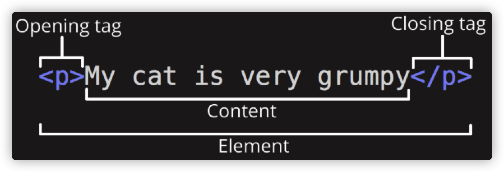
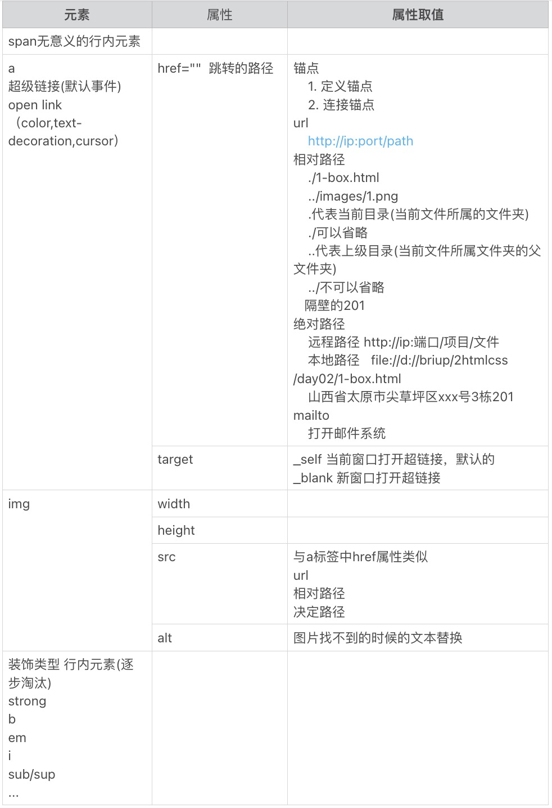

## 1.HTML与CSS

#### 1.1.什么是HTML？什么是CSS？

#####     	HTML是HyperText Markup Language(超文本标记语言)

​		它不是一种编程语言，而是一种标记语言，用于告诉浏览器如何构造你的页面。它可以由一系列HTML元素组合成web开发人员想要的简单或者复杂的页面。“超文本”就是指页面内可以包含图片、链接，甚至音乐、程序等非文字元素。HTML也是一种规范，一种标准，它通过标记符号来标记要显示的网页中的各个部分。网页文件本身是一种文本文件，通过在文本文件中添加标记符，可以告诉浏览器如何显示其中的内容（如：文字如何处理，画面如何安排，图片如何显示等）。浏览器按顺序阅读网页文件，然后根据标记符解释和显示其标记的内容，对书写出错的标记将不指出其错误，且不停止其解释执行过程，编制者只能通过显示效果来分析出错原因和出错部位。可以使用.html与.htm作为HTML文件的后缀名（扩展名）
​    HTML的历史版本发展
​    	①HTML 1.0：在1993年6月作为互联网工程工作小组(IETF)工作草案发布。 

​		②HTML 2.0：1995年1 1月作为RFC 1866发布，于2000年6月发布之后被宣布已经过时。 

​		③HTML 3.2：1997年1月14日，W3C推荐标准。 

​		④HTML 4.0：1997年12月18日，W3C推荐标准。 

​		⑤HTML 4.01（微小改进）：1999年12月24日，W3C推荐标准。 

​		⑥HTML 5：2014年10月，HTML5是公认的下一代Web语言，极大地提升了Web在富媒体、富内容和富应用等方面的能力，被喻为终将改变移动互联网的重要推手。Internet Explorer 8及以前的版本不支持。

​	HTML特点

​		超文本标记语言文档制作不是很复杂，但功能强大，支持不同数据格式的文件镶入，这也是万维网			      	 （WWW）盛行的原因之一，其主要特点如下：

​		1.简易性：超文本标记语言版本升级采用超集方式，从而更加灵活方便。 

​		2.可扩展性：超文本标记语言的广泛应用带来了加强功能，增加标识符等要求，超文本标记语言采取子类		元素的方式，为系统扩展带来保证。 

​		3.平台无关性：虽然个人计算机大行其道，但使用MAC等其他机器的大有人在，超文本标记语言可以使用		在广泛的平台上，这也是万维网（WWW）盛行的另一个原因。 

​		4.通用性：另外，HTML是网络的通用语言，一种简单、通用的全置标记语言。它允许网页制作人建立文		本与图片相结合的复杂页面，这些页面可以被网上任何其他人浏览到，无论使用的是什么类型的电脑或浏		览器。

#####     	CSS (Cascading Style Sheets) 层叠样式表

​		是一个用于修饰文档（可以是标记语言HTML，也可以是XML或者SVN）的语言，可以将文档以更优雅的形式呈现给用户

#### 1.2.HTML和CSS之间的关系？

   1. HTML是网页内容的载体。内容就是网页制作者放在页面上想要让用户浏览的信息，可以包含文字、图片、视频等。

   2. CSS样式是表现。就像网页的外衣。比如，标题字体、颜色变化，或为标题加入背景图片、边框等。所有这些用来改变内容外观的东西称之为表现。

      ##### HTML就像是一个人，而CSS就像是衣服和化妆品，用来装饰HTML

#### 1.3.结构，表现，行为？

##### 	结构

#####         	HTML用于描述页面的结构

#####     表现 

#####         	CSS用于控制页面中元素的样式

#####     行为

#####         	JavaScript用于响应用户操作

## 2.初识HTML

#### 2.1.开发环境搭建

##### 可用于编写HTML的编译工具有很多

- 记事本：特点：无代码提示、无代码高亮显示、用户界面不友好；


- Sublime（推荐）：特点：运行速度快、代码提示、高亮显示、插件拓展、html 插件emmet、sublime text3 安装emmet插件；


- VSCode（推荐）：特点：丰富的插件支持、可进行git管理；


- Idea：特点：集成开发工具、类似DW,node,npm...运行速度较慢；


##### Html是在浏览器上解析执行的，每种浏览器对相同的Html代码解析可能产生不同的结果，所以我们需要安装多种主流的浏览器进行兼容性测试；

主流浏览器：Google Chrome（谷歌）、Firefox（火狐）、Opera、Safari、Microsoft Edge。

##### VSCode插件推荐

​	HTML CSS Support - Html提示Css自动补全

​	HTML Preview - 提供预览HTML文档的功能

​	HTML Snippets - 完整的HTML标签，包括HTML5片段

​	Live Server - 启动一个开发本地服务器，为静态和动态页面提供实时重载功能

​	open in browser - 可以在默认浏览器或应用程序中打开当前文件。

#### 2.2.Hello HTML

​	打开VSCode，新建后缀名为.html的文件，输入"!"或"html:5"生成基本的html5结构

```html
<!-- 文档头信息 -->
<!-- html5标准网页声明 -->
<!-- 不加这一行，就表示页面采用浏览器本身的解析标准，这样会造成页面在不同的浏览器（IE、火狐等）可能出现不同的显示效果。 -->
<!-- h5的文档声明，声明当前的网页是按照HTML5标准编写的编写网页时一定要将h5的文档声明写在网页的最上边。
    如果不写文档声明，则会导致有些浏览器会进入一个怪异模式，进入怪异模式以后，浏览器解析页面会导致页面无法正常显示，所以为了避免进入该模式，一定要写文档声明
-->
<!DOCTYPE html>
<!-- 属性lang是单词language的缩写，意思是语言，”en”代表英语，”zh-CN”代表中文 -->
<!-- 
	html根标签，一个页面中有且只有一个根标签，网页中的所有内容都应该写在html根标签中
-->
<!-- 只有两个子标签 head:浏览器设置 body：可视区展示 -->
<html lang="en">
<!-- head标签，该标签中的内容，不会在网页中直接显示，它用来帮助浏览器解析页面的 -->
<head>
  <!--
				meta标签用来设置网页的一些元数据，比如网页的字符集，关键字、简介
        meta是一个自结束标签，编写一个自结束标签时，可以在开始标签中添加 一个/ 
  -->
  <!-- 
        字符编码，浏览器会根据字符编码进行解析
        常见的字符编码有：gb2312、gbk、unicode、utf-8。
  -->
  <meta charset="UTF-8">
  <!-- 
        viewport 设备的屏幕
        width=device-width width属性控制设备的宽度。假设您的网站将被带有不同屏幕分辨率的设备浏览，				 那么将它设置为 device-width 可以确保它能正确呈现在不同设备上。
        initial-scale=1.0 确保网页加载时，以 1:1 的比例呈现，不会有任何的缩放。
     -->
  <meta name="viewport" content="width=device-width, initial-scale=1.0">
  <!-- 浏览器选项卡上的名字 -->
  <title>Hello HTML</title>
</head>
<!--
	body标签用来设置网页的主体内容，网页中所有可见的内容，都应该在body中编写
-->
<body>
  <!-- 在body里的内容都是显示在浏览器的视图区的 -->
  <!-- 
    	在这个结构中，可以来编写HTML的注释注释中的内容，不会在页面中显示，但是可以在源码中查看我们可以通			过编写注释来对代码进行描述，从而帮助其他的开发人员工作,一定要养成良好的编写注释的习惯，但是注释一			 定要简单明了		
    -->
</body>
</html>
```


>HTML文档（ HTML document）
>DOCTYPE
>在Html非常年轻的时候（1991、2年左右），doctype是用来作为一组规则的链接，HTML页面必须遵循这些规则才能被认为是好的HTML，这些规则会用来检测网页是不是存在问题。然而，这些年没有人真正的关心doctype，他们只是一个历史产物必须包含在页面中。
>
>严格的文档类型

```xml
<!DOCTYPE HTML PUBLIC "-//W3C//DTD HTML 4.01//EN"  "http://www.w3.org/TR/html4/strict.dtd">
```


> 宽松的文档类型

```xml
<!DOCTYPE HTML PUBLIC "-//W3C//DTD HTML 4.01 Transitional//EN"  "http://www.w3.org/TR/html4/loose.dtd">
```


> H5文档类型（ HTML document）说明该文档为Html5文档

```xml
<!DOCTYPE html>
```


> HTML的根元素，用来包含HTML文档的所有元素，所有的html标签应该位于html标签内部

```xml
<html>
```


> 表示html的头部，head内部标签主要用于设置或者导入外部文件，一般不直接显示在浏览器视口中，常用的子标签为 meta 、title、link、script，分别表示元信息设定、文档标题、css、js
>
> 编码：
>
> utf-8    万国码
>
> GBK     国标码
>
> Big5 	繁体字 （环球新闻导报社）
>
> 解码：浏览器

```xml
<head>
```


> 用来声明当前文档的编码方式为utf-8

```xml
<meta charset="utf-8">
```


> 用来声明当前文档的标题，标题将会出现在浏览器的选项卡中

```xml
<title>
```


> 表示html的体部，其内部主要放网页内容，其内容会显示到浏览器视口中，所有想要显示在浏览器中的元素都被包含在该元素中。

```xml
<body>
```


##### html4文档结构：

```xml
<!DOCTYPE HTML PUBLIC "-//W3C//DTD HTML 4.01 Transitional//EN" "http://www.w3.org/TR/html4/loose.dtd">
<html lang="en">
<head>
	<meta http-equiv="Content-Type" content="text/html;charset=UTF-8">
	<style type="text/css"></style>
	<script type="text/javascript"></script>
	<title>Document</title>
</head>
<body>
</body>
</html>
```

#### 2.3.语法

##### 2.3.1.注释

html中只有一种注释，即 <!--注释内容-->

记录编程思路，解释说明业务功能

##### 2.3.2.元素

单标签元素，仅有一个标签

```xml
<meta /> 、、<br/>
```

双标签元素，由开始标签和结束标签组成

```xml
<div></div>
<p></p>
```



标签可以进行嵌套使用，即可以将一个标签写入到另外一个标签内。建议镜面嵌套。

推荐：镜面嵌套

```xml
<p>段落<strong>加强</strong>标签</p>
```

以下是非法的：交叉嵌套

```xml
<p>非法<strong>交叉</p>嵌套</strong>
```

##### 2.3.4.属性

​	HTML标签都拥有自己的属性，属性应该出现在元素的开始标签内部，属性名和属性值通过"="分割，属性与属性之间通过空格分割，属性名不区分大小写，属性值区分大小写并且属性值可以使用双引号引起来。

​	核心属性：绝大多数标签都具有的属性。title、id、class、style。

title：描述信息

```html
<div title="div1">div1</div>
```

id：唯一标识

```html
<div id="div1">div1</div>
```

class：标识一类元素

```xml
<div class="box1">box1</div>
```

style 样式

```html
<div style="color: red;">我是一个div</div>
```

##### 2.3.3.其他

> 空白
> 在文档中无论出现多少个空白或者换行，浏览器都解析为一个空白
> 实体
> 在HTML中，某些字符是预留的。例如：不能使用小于号<和大于号>，这是因为浏览器会误认为它们是标签。如果希望正确地显示预留字符，我们必须在 HTML 源代码中使用字符实体（character entities)，实体以&符开始，以;结尾。以下是常见的实体

| 显示结果 | 描述              | 实体名称         | 实体编号 |
| :------- | :---------------- | :--------------- | :------- |
|          | 空格              | &nbsp            | &#160    |
| <        | 小于号            | &lt              | &#60     |
| >        | 大于号            | &gt              | &#62     |
| &        | 和号              | &amp             | &#38     |
| "        | 引号              | &quot            | &#34     |
| '        | 撇号              | &apos (IE不支持) | &#39     |
| ￠       | 分（cent）        | &cent            | &#162    |
| £        | 镑（pound）       | &pound           | &#163    |
| ¥        | 元（yen）         | &yen             | &#165    |
| €        | 欧元（euro）      | &euro            | &#8364   |
| §        | 小节              | &sect            | &#167    |
| ©        | 版权（copyright） | &copy            | &#169    |
| ®        | 注册商标          | &reg             | &#174    |
| ™        | 商标              | &trade           | &#8482   |
| ×        | 乘号              | &times           | &#215    |
| ÷        | 除号              | &divide          | &#247    |

#### 2.4.块级元素

作用：搭建网页结构

特点：


* 独占一行空间
* 默认宽度为100%
* 高度由子元素或内容决定
* 可以通过css指定其宽度

元素：html、body、div、p、h1~h6、ul->li、ol->li、dl->dd/dt、header、footer、nav、article、section、aside、address...

建议：不要将块级元素嵌套在行内元素中。

| **元素** | **作用**                                    | **已有CSS效果**                   |
| :------- | :------------------------------------------ | :-------------------------------- |
| div      | 无意义的块元素                              |                                   |
| h1~h3    | 标题标题                                    | margin  font-size font-weight     |
| p        | 段落                                        | margin                            |
| ul,li    | 无序列表                                    | margin padding list-style         |
| ol,li    | 有序列表                                    | margin padding list-style         |
| dl,dt,dd | 定义列表                                    | dl - margin    dd - margin        |
| html     |                                             |                                   |
| body     |                                             | margin                            |
| header   | H5新增的语义化标签```<br>```(样式与div类似) | ```<div class="header"></div>```  |
| footer   |                                             | ```<div class="footer"></div>```  |
| nav      |                                             | ```<div class="nav"></div>```     |
| article  |                                             | ```<div class="article"></div>``` |
| section  |                                             | ```<div class="section"></div>``` |
| aside    |                                             | ```<div class="aside"></div>```   |
| address  |                                             | ```<div class="address"></div>``` |

#### 2.4.行内元素

作用：在结构中填充网页内容

特点：

* 与其他行内元素共享一行空间
* 宽高由自身决定
* 由于不用来搭建网页结构，所以也无需通过css指定其宽度
* 行内元素中不可以嵌套块元素

元素：span、a、img、strong、b、i、em、sub、sup...



## 3.基础标签的使用

##### - h标签

h标签 标题标签
在HTML中，一共有六级标题标签
h1~h6
在显示效果上，h1最大，h6最小，但是文字的大小我们并不关心
6级标题中，h1的最总要，表示一个网页中的主要内容，h2~h6重要性依次降低，对于搜索引擎来说，
h1的重要性仅仅次于title，搜索引擎检索完title会立即查看h1中的内容
h1标签非常重要，它会影响到页面在搜索引擎中的排名，一个页面最好只写一个h1标签
一般的页面中，我们只使用h1 h2 h3，其他的基本不用

```html
<h1>这是一个h1标签</h1>
```

##### - p标签

段落标签，段落标签用于表示内容中的一个自然段
使用p标签来表示一个段落
p标签中的文字，会独占一行，并且段与段之间会有一个间距

```html
<p>
    段落标签，段落&quot;标签&quot;用于表示内容中的一个自然段,<br><hr>
    使用p标签来表示一个段落,
    p标签中的文字，会独占一行，并且段与段之间会有一个间距
</p>
```

##### - br标签

br标签 表示换行标签 br标签是一个自结束标签 br标签的语义是不另起一个段落换行, 而在企业开发中一般情况下需要换行都是因为需要另起一个段落, 所以在企业开发中很少使用br标签

##### -hr标签

hr标签 可以在页面中生成一个分割线

##### - 字符实体

```html
空格  &nbsp;
  <  &lt;
  >  &gt;
  “  &quot;
  &  &amp;
  ‘  &apos;
```

##### -  img标签

img标签 告诉浏览器要显示一张图片

```html
img标签的格式 

```

src:设置一个图片的路径（绝对路径和相对路径，最好使用相对路径）
alt:可以用来设置在图片不能显示的时，对图片的描述
img标签的其他属性
width:设置图片的宽度
height:设置图片的高度
title：用于告诉浏览器，鼠标悬停的时候，需要弹出的描述框中显示什么内容。

```html

```

注意点：

​		1.px 单位名称为像素，相对长度单位，像素px是相对于显示器屏幕分辨率而言的。像素的使用性特

​		别广。

​    	2.如果不设置img标签的宽度和高度，那么图片就会按照默认的样式显示，如果设置了宽高，img就

​		会按照设置的宽高来显示。

​        3.有时设置img的宽高会使图片失真，这时只需要设置宽度或者高度中的一个，另外一个会等比例调整。

​        4.一般除了自适应的页面，不建议设置width和height。

​        5.和h标签以及p标签不同的是，img标签不会独占一行

##### - a标签

a标签的作用 用于控制页面与页面之间跳转的
a标签的格式 

```html
<a href="指定需要跳转的目标界面">需要展现给用户查看的内容</a>
<a href="https://www.baidu.com" target="_blank" title="百度">百度一下</a>
```

a标签中还有一个叫做target的属性，这个属性专门用于控制如何跳转
    self:用于当前的选项卡中进行跳转，也就是不新建页面跳转，默认就是_self
    _blank:用于在新的选项卡中进行跳转，也就是新建页面跳转
a标签也有一个title属性，效果和img标签的title类似

​    注意点:
​    1.a标签不仅可以让文字点击，也可以让图片被点击
​    2.一个a标签必须有一个href属性，否则a标签不知道要跳转到什么地方
​    3.如果通过a标签href属性指定一个URL地址，那么必须在地址前面加上http://或者https://
​    除了URL地址，还可以指定一个本地地址

##### - mailto链接

mailto链接是一种html链接，能够设置你电脑中邮件的默认发送信息。但是需要你电脑中安装默认的E-mail软件，类似Microsoft Outlook等等。加入您已经安装了Microsoft Outlook，那么直接点击mailto链接就可以获得默认设置的邮件信息。

使用方式：

```html
<a href="mailto:name@email.com">Email</a>
```

更多使用方式

|          参数           |                   描述                   |
| :---------------------: | :--------------------------------------: |
| mailto:*name@email.com* |            电子邮件收件人地址            |
|   cc=*name@email.com*   |                 抄送地址                 |
|  bcc=*name@email.com*   |               密件抄送地址               |
| subject=*subject text*  |               e-mail的题目               |
|    body=*body text*     |               e-mail的内容               |
|            ?            | 和浏览器地址操作一样，第一个参数符合是？ |
|            &            |             其他参数符号是&              |

##### - base标签

base标签就是专门用来统一指定当前页面中所有的a标签需要如何打开
        注意点
        1.base标签必须要写在head标签之间
        2.如果既在base中指定了target又在a标签中指定了target，那么浏览器会按照a标签中指定的来执行

```html
<head>
    <meta charset="UTF-8">
    <meta name="viewport" content="width=device-width, initial-scale=1.0">
    <meta http-equiv="X-UA-Compatible" content="ie=edge">
    <title>Document</title>
    <base target="_blank">
</head>
<body>
    <a href="https://www.baidu.com" target="_self">百度</a>
    <a href="https://www.baidu.com">百度</a>
</body>
```

##### -假链接

什么是假链接？
就是点击之后不需要跳转的链接我们称之为假链接

​    在企业开发初期，其他的界面都没有完成，所以不知道跳转到什么地方，这个时候先用假链接来代替，项目完成后再换成真链接

假链接的格式
    1.# 直接回到页面的顶部
    2.javascript: 不会自动回到页面的顶部

```html
<a href="#">回到顶部</a>
<a href="javascript:">点我啊</a>
```

##### - 锚点

1.要想通过a标签跳转到指定的位置, 那么必须告诉a标签一个独一无二的身份证号码, 这样a标签才能在当前界面中找到需要跳转到的目标位置

2.如何和HTML中的标签绑定一个独一无二的身份证号码呢?
在HTML中, 每一个标签都有一个名称叫做id的属性, 这个属性就是用来给标签指定一个独一无二的身份证号码的

3.所以要想实现通过a标签跳转到指定的位置分为两步
   3.1给目标位置的标签添加一个id属性, 然后指定一个独一无二的值
   3.2告诉a标签你需要跳转到的目标标签对应的独一无二的身份证号码是多少
   格式:

```html
<a href="#center">跳转</a>
<br>
<br>
<br>
<br>
<br>
<br>
<br>
<br>
<p id="center">我是中部</p>
<br>
<br>
<br>
<br>
<br>
<br>
<br>
<br>
```

注意点:
    1.通过我们的a标签跳转到指定的位置, 是没有过度动画的, 是直接一下子就跳转到了指定位置
    2.a标签除了可以跳转到当前界面的指定位置以外, 还可以在跳转到其它界面的时候直接跳转到其它界面的指定位置
    格式:

```html
//a.html
<a href="b.html#bottom" target="_blank">跳转</a>
```

```html
//b.html
<p id="bottom">找到我</p>
```

##### - em

意为强调，突出文章重点

##### - strong

意为强调，内容更为有用

##### - b

加粗

##### - i

斜体

##### - u

下划线

##### - div

div是一个无语义的标签，就是一个纯粹的块元素，并且不会为它里边的元素设置任何的默认样式，div元素主要用来进行页面基本结构的搭建

```html
<div class="header"></div>
<div class="content"></div>
<div class="footer"></div>
```

##### - span

span没有任何的语义，span标签专门用来选中文字，然后为文字来设置样式

##### - video(H5新增)

作用：播放视频
webm 网页中专用的视频格式

```html
格式:<video src=""></video>
```

video标签的属性
   src:告诉video标签需要播放的视频地址
   autoplay:用于告诉video标签是否需要自动播放视频
   controls:用于告诉video标签是否需要控制条
   poster:用于告诉video标签视频没有播放之前显示的占位图片
   loop:一般用于做广告视频，用于告诉video标签视频播放完毕之后是否需要循环播放
   muted:静音
   width/height: 和img标签中的一模一样
video的第二种格式
1.格式:

```
<video>
    <source src="" type=""></source>
    <source src="" type=""></source>
</video>
```

2.第二种格式存在的意义:
    由于视频数据非常非常的重要, 所以五大浏览器厂商都不愿意支持别人的视频格式, 所以导致了没有一种视频格式是所有浏览器都支持的
    这个时候W3C为了解决这个问题, 所以推出了第二个video标签的格式
    video标签的第二种格式存在的意义就是为了解决浏览器适配问题
    video 元素支持三种视频格式, 我们可以把这三种格式都通过source标签指定给video标签, 那么以后当浏览器播放视频时它就会从这三种中选择一种自己支持的格式来播放

3.注意点:
    3.1当前通过video标签的第二种格式虽然能够指定所有浏览器都支持的视频格式, 但是想让所有浏览器都通过video标签播放视频还有一个前提条件, 就是浏览器必须支持HTML5标签, 否则同样无法播放
    3.2在过去的一些浏览器是不支持HTML5标签的, 所以为了让过去的一些浏览器也能够通过video标签来播放视频, 那么我们以后可以通过一个JS的框架叫做html5media来实现

```html
<video autoplay="autoplay" controls="controls">
    <source src="images/sb1.webm" type="video/webm"></source>
    <source src="images/sb1.mp4" type="video/mp4"></source>
    <source src="images/sb1.ogg" type="video/ogg"></source>
</video>
```

##### - audio(H5新增)

作用: 播放音频

格式:

```html
<audio src=""></audio>
<audio>
    <source src="" type="">
</audio>
```

注意点:
	audio标签的使用和video标签的使用基本一样, video中能够使用的属性在audio标签中大部分都能够使用, 并且功能都一样
	只不过有3个属性不能用, height/width/poster

#### HTML5新增语义化标签

除语义外，与div相同。新的标签带来的是网页布局的改变及提升对搜索引擎的友好。

##### header

```<header>```是一种具有引导和导航作用的结构元素，通常用来放置整个页面或页面内的一个内容区块的标题，但也可以包含搜索表单或logo。

##### nav

```<nav>```是一个可以用作页面导航的链接组，其中导航元素链接到其他页面或当前页面的其他部分。

##### article

```<article>```代表文档，页面或应用程序中独立的，完整的，可以独自被外部引用的内容，也可以嵌套使用。可以是一篇博客或者报刊中的文章，一篇论坛帖子，一段用户评论或者独立的插件，或其他任和独立的内容。

##### section

```<section>```作为Html文档独立的功能。

##### aside

```<aside>```元素用来表示当前页面或文章的附属信息部分，它可以包含当前页面或主要内容相关的引用，侧边栏，广告，导航条，以及其他类型的有别于主要内容的部分。

##### footer

```<footer>```元素作为其上层父级内容区块或是一个根区块的脚注。footer通常包括其相关区块的脚注信息，如作者，相关阅读连接以及版权信息等。与header类似，一个页面中也未限定footer元素的个数。

##### address

```<address>```元素用来在文档中呈现联系信息，包括文档作者或文档维护者名字，他们的网站链接，电子邮箱，真实地址，电话号码，以及跟文档相关的联系人的所有联系信息。
在不支持Html5的浏览器中，由于浏览器无法识别Html5新增标签，所以默认将这些标签设置为行内元素（display:inline）,为了兼容性，需要：
section, article, aside, footer, header, nav, hgroup { display:block; }
但是上述方法有局限性，比如在IE8以及更早版本，是无法对未知元素进行样式的修饰，因此需要：图

##### figure& figcaption

figure元素是一种元素的组合，带有可选标题，figure元素用来表示网页上一块独立内容，将其从网页上移除后不会对网页上的其他内容产生任何影响，figure元素所表示的内容可以是图片，统计图或代码示例，也可以是音频插件，视频插件，统计表格等。figcaption元素表示figure元素的标题，它从属于figure元素，必须书写在figure元素内部。一个figure元素内最多只允许放置一个figcaption元素，但是允许放置多个其他元素。

多用于用作文档中插图的图像。

##### details

details元素是一种用于标识该元素内部的子元素可以被展开,收缩显示的元素。details元素内并不仅限于放置文字，也可以放置表单,插件或对于一个统计图提供的详细数据表格。

##### 		open属性

​			当该属性值为true时，该元素内部的子元素应该被展开显示；当该属性的值为false时，其内部的子元			素应该被收缩起来不显示。默认值为false

##### 		summary子元素

​			summary元素从属于details，用鼠标单击summary元素中的内容文字时，details元素中的其他所有从			属元素将会展开或收缩。如果details元素内没有summary元素，浏览器会提供默认文字(详细信息)以供			单击。