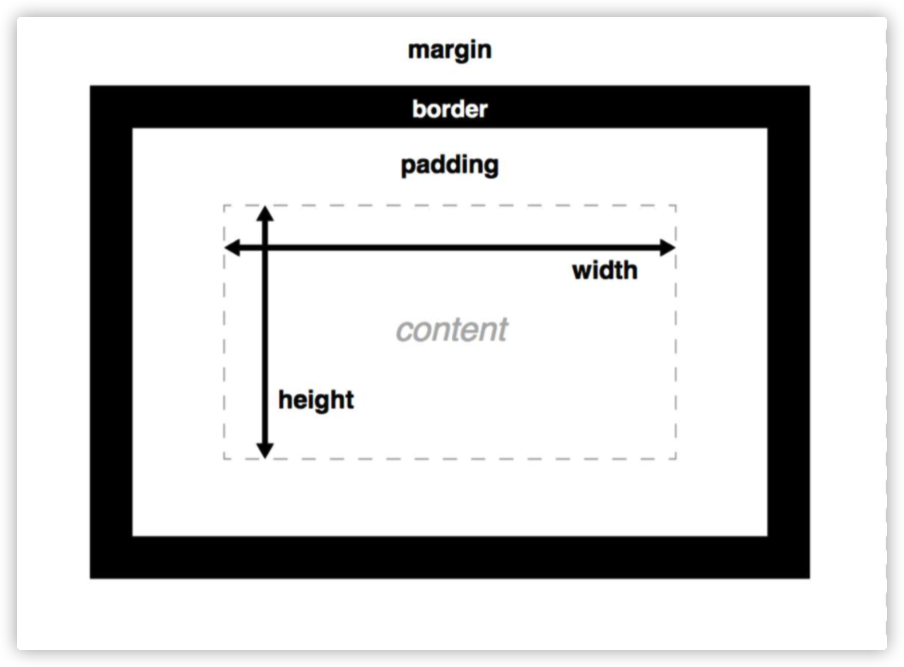
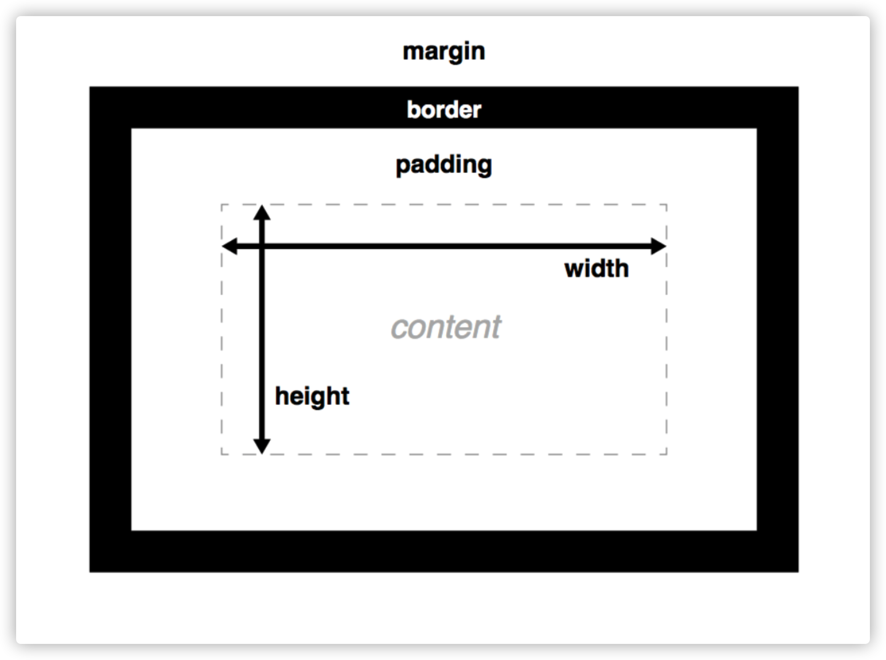
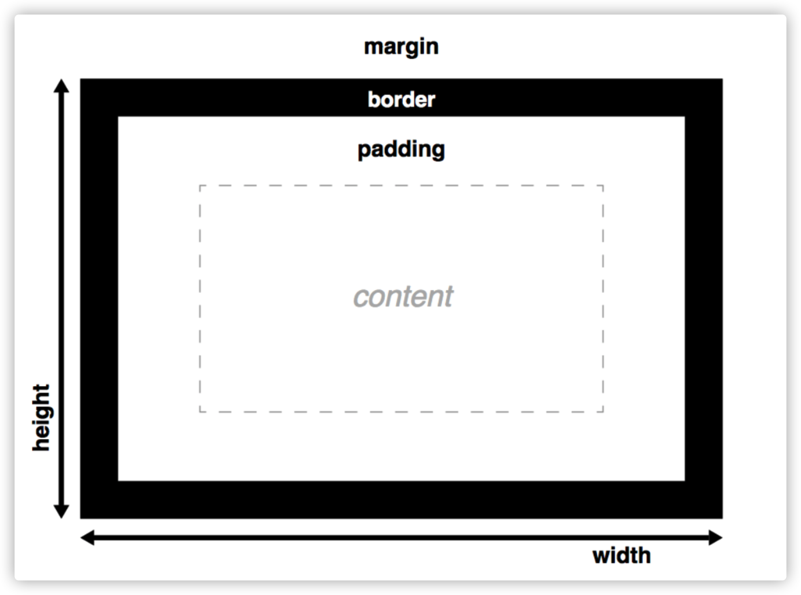

## 1.盒子组成

#### 盒子属性（ Box properties）

​	文档中的每个元素都可以被看作是一个矩形盒子。具有如图的一些属性。

##### margin 

​	外边距 代表盒子四周的区域。相邻元素的边距会合并（margin collapsing）

##### border

​	设定介于padding的外边缘与margin的内边缘之间，默认值为0

##### padding 

​	内间距 在任何定义的边界内的元素内容周围生成空间

##### width & height	

​	用于设置内容区的宽高，该片区域用于显示内容。盒子高度默认为内容的高度。

##### 盒子一般指的是块元素，盒子是我们布局的重要机制。一个盒子应该由外边距、边框、内边距、内容组成。

#### - width & height

​		width

​			内容宽度，块级元素默认 100%，单位可以：px em %

​		height

​			内容高度，默认 0 ，由子元素填充，单位可以： px em %

​		max-width

​			定义元素的最大宽度。该属性值会对元素的宽度设置一个最高限制。因此，元素可以比指定值窄，但不			能比其宽。不允许指定负值。

​		min-height

​			属性设置元素的最小高度。该属性值会对元素的高度设置一个最低限制。因此，元素可以比指定值高，			但不能比其矮。不允许指定负值。

#### - 边框属性

##### 		1.什么是边框?

​        	边框就是环绕在标签宽度和高度周围的线条

##### 		2.边框属性的格式

​        	边框宽度
​        		border-width: 5px;

​        	边框样式
​        		border-style: solid;
​            边框样式取值：
​            	none    定义无边框。
​            	hidden  与 "none" 相同。不过应用于表时除外，对于表，hidden 用于解决边框冲突。
​            	dotted  定义点状边框。在大多数浏览器中呈现为实线。
​            	dashed  定义虚线。在大多数浏览器中呈现为实线。
​            	solid   定义实线。
​            	double  定义双线。双线的宽度等于 border-width 的值。
​            	groove  定义 3D 凹槽边框。其效果取决于 border-color 的值。
​            	ridge   定义 3D 垄状边框。其效果取决于 border-color 的值。
​            	inset   定义 3D inset 边框。其效果取决于 border-color 的值。
​            	outset  定义 3D outset 边框。其效果取决于 border-color 的值。
​        	边框颜色
​        		border-color: red;
​			2.1连写(同时设置四条边的边框)
​    			border: 边框的宽度 边框的样式 边框的颜色;

​    		快捷键:
​    			bd+ border: 1px solid #000;

​    		注意点:
​    			1.连写格式中颜色属性可以省略, 省略之后默认就是黑色
​    			2.连写格式中样式不能省略, 省略之后就看不到边框了
​    			3.连写格式中宽度可以省略, 省略之后还是可以看到边框

​    		2.2连写(分别设置四条边的边框)
​    			border-top: 边框的宽度 边框的样式 边框的颜色;
​    			border-right: 边框的宽度 边框的样式 边框的颜色;
​    			border-bottom: 边框的宽度 边框的样式 边框的颜色;
​    			border-left: 边框的宽度 边框的样式 边框的颜色;

​    		快捷键:
   			bt+ border-top: 1px solid #000;
   		    br+
   		    bb+
​    		   bl+

​    		2.3连写(分别设置四条边的边框)
​    			border-width: 上 右 下 左;
​    			border-style: 上 右 下 左;
​    			border-color: 上 右 下 左;

​    		注意点:
​    			1.这三个属性的取值是按照顺时针来赋值, 也就是按照上右下左来赋值, 而不是按照日常生活中的上下				左右
​    			2.这三个属性的取值省略时的规律
​    				2.1上 右 下 左 > 上 右 下  -  左边的取值和右边的一样
​    				2.2上 右 下 左 > 上 右  -  左边的取值和右边的一样 下边的取值和上边一样
   			 	2.3上 右 下 左 > 上  -  右下左边取值和上边一样

#####     	3.非连写(方向+要素)

​    		border-left-width: 20px;
​    		border-left-style: double;
​    		border-left-color: pink;

##### 		4.border-radius

​			为元素指定圆角边框的半径取值：绝对值  px、mm 、cm 相对值  em 、rem %

#### - 外边距属性

##### 		1.什么是外边距?

​    		标签和标签之间的距离就是外边距

#####     	2.格式

​    		2.1非连写
​    			margin-top: ;
​    			margin-right: ;

​					浏览器是默认左对齐的。看起来margin-right没有生效，其实有效果的，只是在默认即标准流的情					况的下显示不出来效果，可以加右浮动脱离标准流。

​    			margin-bottom: ;
​    			margin-left: ;

​    		2.2连写
​    			margin: 上 右 下 左;

#####     	3.这三个属性的取值省略时的规律

​    		3.1上 右 下 左 > 上 右 下 - 左边的取值和右边的一样
​    		3.2上 右 下 左 > 上 右 - 左边的取值和右边的一样 下边的取值和上边一样
​    		3.3上 右 下 左 > 上 - 右下左边取值和上边一样

​    	注意点:
​    		外边距的那一部分是没有背景颜色的

#####     	4.外边距合并现象

​        	在默认(标准流)布局的垂直方向上, 默认情况下外边距是不会叠加的, 会出现合并现象, 谁的外边距比较大就听谁的。

​			水平方向上的外边距会叠加.

#### - 内边距属性

##### 		1.什么是内边距?

​    		边框和内容之间的距离就是内边距

#####     	2.格式

​    		2.1非连写
​    			padding-top: ;
   		 	padding-right: ;
​    			padding-bottom: ;
​    			padding-left: ;

​    		注意点:
​        		1.给标签设置内边距之后, 标签占有的宽度和高度会发生变化
​        		2.给标签设置内边距之后, 内边距也会有背景颜色

​    		2.2连写
​    			padding: 上 右 下 左;

#####     	3.这三个属性的取值省略时的规律

​    		3.1上 右 下 左 > 上 右 下 > 左边的取值和右边的一样
​    		3.2上 右 下 左 > 上 右 > 左边的取值和右边的一样 下边的取值和上边一样
​    		3.3上 右 下 左 > 上 > 右下左边取值和上边一样

## 2.CSS盒模型

​		CSS盒子模型仅仅是一个形象的比喻，每一个可见的HTML元素都是一个盒子，一个盒子由外到内可以分成四个部分：margin（外边距）、border（边框）、padding（内边距）以及content（内容）。

​		我们可以发现margin、padding和border都是CSS属性，它们三是用来控制盒子的边距边框，而content就是描述HTML元素的内容，通过width/height属性设置content的宽度和高度。

#### - 内容盒子(W3C盒子)

##### 		默认盒子模型  W3C盒子

​			使用box-sizing属性可以改变盒子模型，取值“content-box”的盒子为默认盒子模型。

​			width 属性仅表示盒子内容所占的宽度

​			height 属性仅表示盒子内容所占的高度

##### W3C盒子 

> 内容区的宽	
>
> ​	width 
>
> 内容区的高	
>
> ​	height 
>
> 盒子的宽  
>
> ​	width+paddingLeft+paddingRight+borderLeft+borderRight  
>
> 盒子的高  
>
> ​	height+paddingTop+paddingBottom+borderTop+borderBottom 
>
> 所占屏幕空间的宽  
>
> ​	width+paddingLeft+paddingRight+borderLeft+borderRight +marginLeft+marginRigh
>
> 所占屏幕空间的高
>
> ​	height+paddingTop+paddingBottom+borderTop+borderBottom+marginTop+marginBottom

​		内容盒子也称为普通盒子，其特点为：当我们为一个盒子指定width属性的时候，实际上width仅为内容的宽度，当padding和border变大的时候，内容宽度不变，盒子所占的总体宽度要变大。

#### - 边框盒子(IE盒子模型)

​		边框盒子模型  

​		IE盒子使用box-sizing属性可以改变盒子模型，取值“border-box”的盒子为边框盒子模型。

##### IE盒子

> 内容区的宽  
>
> ​	width-paddingLeft-paddingRight-borderLeft-borderRight 
>
> 内容区的高  
>
> ​	height-paddingTop-paddingBottom-borderTop-borderBottom 
>
> 盒子的宽	
>
> ​	width  
>
> 盒子的高	
>
> ​	height 
>
> 所占屏幕空间的宽  
>
> ​	width+marginLeft+marginRight  
>
> 所占屏幕空间的高   
>
> ​	height+marginTop+marginBottom

​		边框盒子也称为怪异盒子，其特点为：当我们为一个盒子指定width属性的时候，实际上width包含了border和padding的宽度，如果border不变，padding变大，这时候内容会变小。

#### - 盒子模型注意点

​        1.如果两个盒子是嵌套关系, 那么设置了里面一个盒子(子元素)顶部的外边距, 外面一个盒子(父元素)也会被		顶下来。

#####         原因

​        子元素和父元素上边框重合在一起。
​        因为父元素的第一个子元素的顶部外边距margin-top如果碰不到有效的border或者padding，就会不断		一层一层的找自己父元素的麻烦。只要给父元素设置一个有效的border或padding就可以有效的管制这个		margin-top，防止它越级，把自己的margin-top当成父元素的margin-top执行。

​    	2.如果外面的盒子不想被一起定下来,那么可以给外面的盒子添加一个边框属性。

​    	3.在企业开发中, 一般情况下如果需要控制嵌套关系盒子之间的距离, 应该首先考虑padding, 其次再考虑		margin，margin本质上是用于控制兄弟关系之间的间隙的。

​        4.只有普通文档流中块框的垂直外边距才会发生外边距合并。行内框、浮动框或绝对定位之间的外边距不		会合并。

​	    5.在嵌套关系的盒子中, 我们可以利用margin: 0 auto;的方式来让里面的盒子在外面的盒子中水平居中
​    	margin:0 auto = margin:0 auto 0 auto，表示上下为0，左右为auto；
​    	6.margin: 0 auto; 只对水平方向有效, 对垂直方向无效

## 3.盒子背景样式

#### - background-color 背景颜色

​		专门用来设置标签的背景颜色的
​        取值:
​        	具体单词
​        	rgb
​        	rgba
​        	十六进制

​    	 快捷键:
​    		bc background-color: #fff;

#### - background-image 背景图片

​		专门用于设置背景图片的
​    		快捷键:
​    			bi background-image: url();

​    	 注意点:
​    		1.图片的地址必须放在url()中, 图片的地址可以是本地的地址, 也可以是网络的地址
​    		2.如果图片的大小没有标签的大小大, 那么会自动在水平和垂直方向平铺来填充
   		 3.如果网页上出现了图片, 那么浏览器会再次发送请求获取图片

#### - background-repeat 背景平铺属性

​		专门用于控制背景图片的平铺方式的

​    	取值:
​    		repeat 默认, 在水平和垂直都需要平铺
   		 no-repeat 在水平和垂直都不需要平铺
​    		repeat-x 只在水平方向平铺
​    		repeat-y 只在垂直方向平铺

   	 快捷键
    		bgr background-repeat:

#### - background-position 背景定位属性

​		专门用于控制背景图片的位置
​    	格式:
​    		background-position: 水平方向 垂直方向;

​    	取值
​    		具体的方位名词
​    		水平方向: left center right
​    		垂直方向: top center bottom

​    	具体的像素
​    		例如: background-position: 100px 200px;
​    		记住一定要写单位, 也就是一定要写px
​    		记住具体的像素是可以接收负数的

   	 快捷键:
    		bp background-position: 0 0;

​    	注意点:
​    		同一个标签可以同时设置背景颜色和背景图片, 如果颜色和图片同时存在, 那么图片会覆盖颜色

#### -背景属性的缩写

​    背景属性缩写的格式
​    background: 背景颜色 背景图片 平铺方式 关联方式 定位方式;

​    快捷键:
​    bg+ background: #fff url() 0 0 no-repeat;

​    注意点：
​    background属性中， 任何一个属性都可以被省略

#### 什么是背景关联方式？

​    	默认情况下背景图片会随着滚动条的滚动而滚动， 如果不想让背景图片随着滚动条的滚动而滚动， 那么		我们就可以修改背景图片和滚动条的关联方式.

#### 如何修改背景关联方式？

​    在CSS中有一个叫做background-attachment的属性， 这个属性就是专门用于修改关联方式的

​    格式
​    background-attachment：scroll;

​    取值：
​    scroll 默认值， 会随着滚动条的滚动而滚动
​    fixed 不会随着滚动条的滚动而滚动

​    快捷键:
​    ba background-attachment:;

​    -背景图片和插入图片区别?
​    	背景图片仅仅是一个装饰, 不会占用位置
​    	插入图片会占用位置

​    	背景图片有定位属性, 所以可以很方便的控制图片的位置
​    	插入图片没有定位属性, 所以控制图片的位置不太方便

​    	插入图片的语义比背景图片的语义要强, 所以在企业开发中如果你的图片想被搜索引擎收录, 那么推荐使用		插入图片